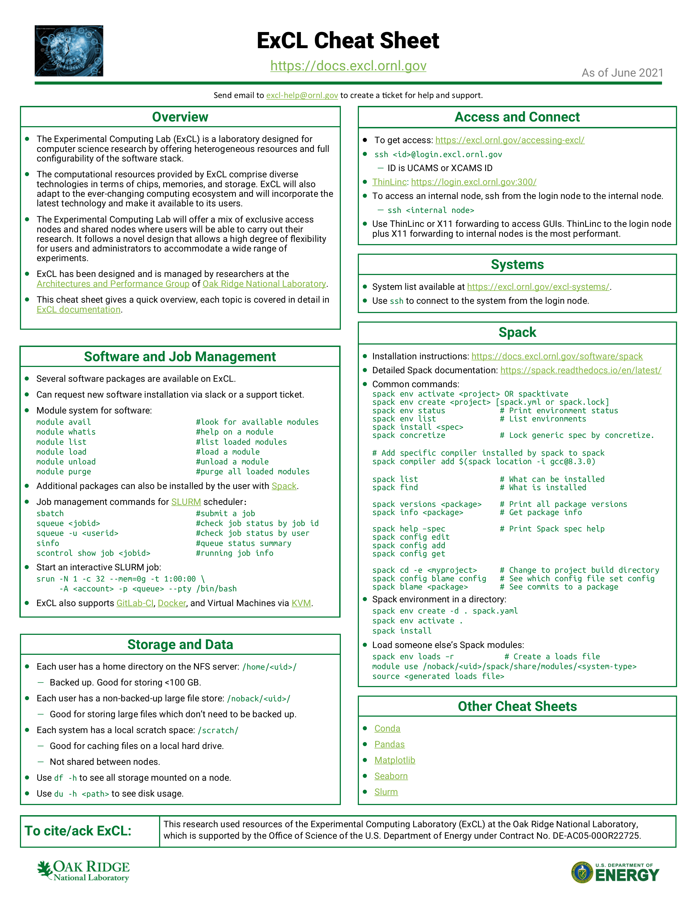

# Introduction

This is the user documentation repository for the [Experimental Computing Laboratory \(ExCL\)](https://excl.ornl.gov/) at Oak Ridge National Laboratory.

This site is undergoing development; systems and processes will be documented here as the documentation is created.

See the index on the left of this page for further detail.

Please acknowledge in your publications the role the Experimental Computing Laboratory \(ExCL\) facility played in your research. Alerting us when a paper is accepted is also appreciated. See [Acknowledgment](acknowledgment.md) for details.

See [Requesting access](excl-support/access-info.md) for information on how to request access to the system.

## Useful URLs

* [login.excl.ornl.gov](https://login.excl.ornl.gov:300)
* [excl.ornl.gov](https://excl.ornl.gov/)
* [excl.ornl.gov/systems](https://excl.ornl.gov/excl-systems/)

## How to Login

See [Access to ExCL](excl-support/access.md) for more details.

* `ssh login.excl.ornl.gov`
* [login.excl.ornl.gov](https://login.excl.ornl.gov:300)

## ExCL Cheat Sheet





