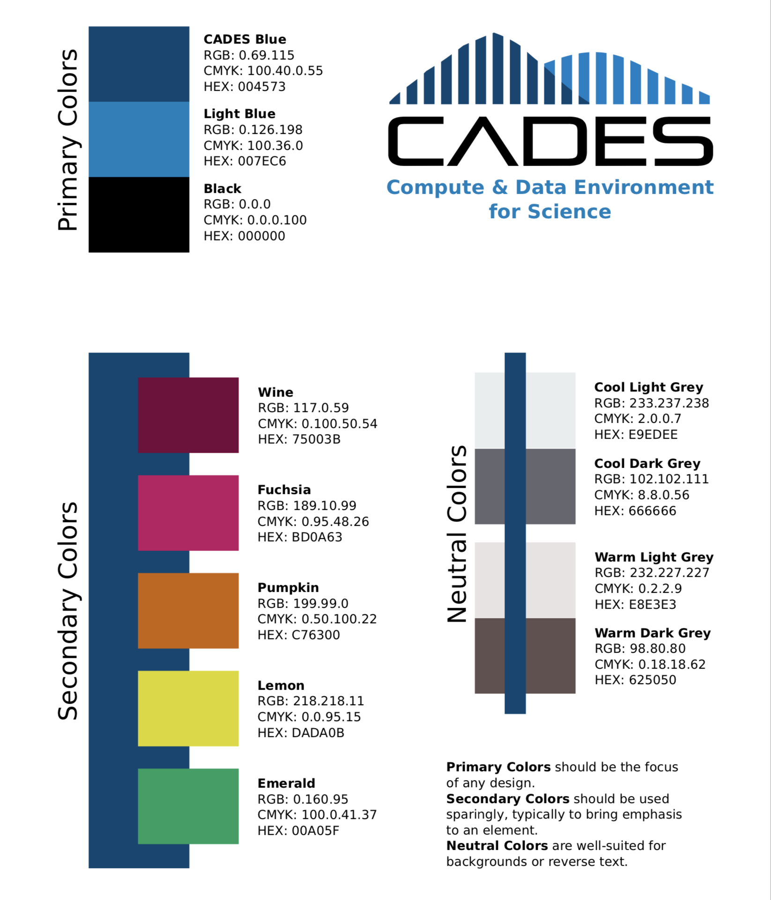

[CADES](http://cades.ornl.gov/) &rarr; [User Documentation](../README.md)  &rarr; [Contribute](../CONTRIBUTING.md)  &rarr; [Authoring Guide](authoring-guide.md)

# Authoring Guide for CADES

Perhaps you've got some how-to documents tucked away in folders that you'd like to share with the CADES community. Or maybe you've discovered a way of doing things that would benefit other users.

You can submit your user guides for publication within the [CADES documentation site](http://support.cades.ornl.gov/user-documentation/_book/)! See the [contributing](../CONTRIBUTE.md) page for instructions.

We've assembled here the fundamental authoring guidelines for CADES user documentation.

## Document and Content Preferences

- Documents should be created using [markdown](https://docs.gitlab.com/ee/user/markdown.html) using the [commonmark](https://docs.gitlab.com/ee/user/markdown.html#transitioning-to-commonmark) syntax.
- Oak Ridge National Laboratory (ORNL) uses the [_Chicago Manual of Style_](http://www.chicagomanualofstyle.org/home.html) (_CMOS_) as a basic style guide.
- Define the first instance of every acronym in each document. Ensure that the long form is not repeated after it is defined.
- Buttons and links that the user should "click" should go in `code`. For example, "Next, click the `Manage Rules` button."
- Put `&#128221;` in front of NOTES. Renders: 📝
- Use `&#9662;` for those "carrot" drop-down menus. Renders: ▾
- For headings: only use title case for the first three heading levels, `#`, `##`, and `###`. The remaining header levels should be sentence case.

## Pictures and Images

Screenshots and images cannot be resized using markdown. Therefore, we embed `.html` that is rendered when we publish the tutorial to the documentation site.

- Images and screenshots should be stored in a folder `./screenshots/`.
- Files should be named descriptively. For example, use names such as `adding-IP-address.png` instead of `image03.png`.
- To remain consistent with other images in tutorials, please use the following `.html` code to resize, add a border, and open in a new browser tab when clicked. Note that you'll need to change the file name twice in the following code.

  ```
  <a target="_new" href="screenshots/ssh_import_pub_key.png"></a>
  ```

## Other Considerations

- Have you redacted sensitive information from text and images?
- Have you removed information that is protected by copyright?
- Are you using a specific version of your software and have you included in the documentation?

## CADES Brand Guide

The CADES brand helps define our resources and team culture. A portion of the guide is provided here to assist you in choosing a color scheme for your media and documentation.

<a href="CADES-Brand-Guide.pdf" target="_blank">Download CADES Abridged Brand Guide</a>    
    <a href="CADES-Brand-Guide.pdf" target="_blank"></a>   

<!--  o_  -->

## Related Topics

- Using a [Git Workflow](git-workflow.md) for creating user content.
