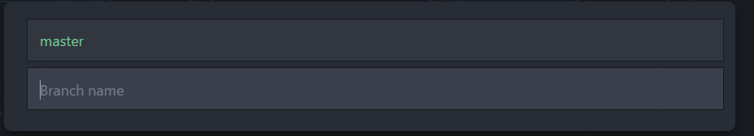
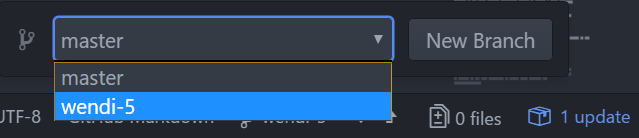

# Git Atom Workflow

[ExCl](https://docs.excl.ornl.gov) → [User Documentation](../../) → [Contributing](../../excl-support/contributing.md) → [Git Workflow](https://github.com/ORNL-ExCL/excl-user-docs/tree/5b0a2bac08c6595857ffaa414e0a315a8fdfa27c/contributing/contributing/git-workflow.md)

## ExCl Recommended Workflow _Using Git and Atom_

#### GitHub Houses our Documentation

GitHub is a popular platform to share code, store software solutions, and host documentation.

Project owners control access to GitHub repositories. You may log in and create your projects and repositories, and share them with others.


_Jump to a Section:_

* [Setup](git-workflow.md#setup)
* [Checkout](git-workflow.md#checkout)
* [Edit](git-workflow.md#edit)  &#x20;
* [Add](git-workflow.md#add)
* [Commit](git-workflow.md#commit)
* [Push](git-workflow.md#push)
* [Merge](git-workflow.md#merge)

Would you prefer not to use the Atom Text Editor? We also have documentation for [Git in the command line](git-command-line.md).

It is assumed that users of this guide understand basic Git/version control principles. To learn more about Git basics with our basic Git tutorial, visit [this page](./).

### Setup

This section covers the setup procedures for Atom and Git.

**Atom Text Editor Setup**

While there are many text editors to choose from, Atom is recommended due to its ability to be customized and integrated with GitHub/Git.

> Install Atom: [https://atom.io/](https://atom.io/)

Atom has several packages which enhance the user experience and some of them you'll need for the workflow. The packages can be installed by entering the `Settings` screen and choosing `Install`. There are thousands of packages, so try some out and have fun.

* Necessary Packages:
  * git-plus (integrates Git)
  * git-checkout (allows checking out remote branches within Atom)
* Optional but Recommended Packages:
  * linter (aids in code validation, will also need linter package for each language)
  * minimap (displays thumbnail version of document along with your location within it)
  * todo-show (provides visuals for _TODO_ and _FIXME_ tags)
*   Navigate to the GitHub repository in your web browser. For this example, we'll use the `user-documentation` repository. Copy the SSH address to your machine's clipboard.

    
* _(Optional)_ Consider adding your SSH key to your GitHub profile so you are not prompted for credentials after every commit. To add your public SSH key to GitHub:
  * Click on your user image in the top-right of the GitHub window.
  * Select `Settings`.
  * On the left, click `SSH keys`.
  * Paste your _**public**_ SSH key in the box, provide a title, and save by clicking `Add key`.
* Now, back inside Atom, open the `Command Palette`. On Mac, press `command`+`shift`+`p`. In Windows/Linux, press `control`+`shift`+`p`.
* Type `git clone` and press `enter`.
* Paste the SSH address in the resulting window. You may also modify the location of the local folder.
* Wait for the repository to clone.
* Now you can see the files have populated into the folder you specified. These files represent a local copy, to which you will make changes.

**Git Setup**

*   First, use the command line to see if Git is installed. (Windows users may check their list of currently installed programs.)

    ```bash
    git --version
    ```

    * To install or update Git using your package manager:
      *   CentOS, RedHat:

          ```bash
          sudo yum install git
          sudo yum update git
          ```
      *   Debian, Ubuntu:

          ```bash
          sudo apt-get install git
          sudo apt-get update git
          ```
      *   MacOS, use [Homebrew](https://brew.sh/):

          ```bash
          /usr/bin/ruby -e "$(curl -fsSL https://raw.githubusercontent.com/Homebrew/install/master/install)"
          brew install git
          brew upgrade git
          ```
      * Windows: download [Git for Windows](https://gitforwindows.org/) and install it.
*   Set up Git with your access credentials to GitHub with the following commands:

    ```bash
    git config --global user.name "your_username"
    git config --global user.email "your_email_address@example.com"
    ```

    * You can review the information that you entered during set-up: `git config --global --list`

### Checkout

**Working from Branches**

At this point, you likely either want to create a new branch and add your contributions there or checkout a different branch you or someone else has already created. Each of these option is shown next. Unless you have reason otherwise you should choose one of these, rather than attempting to work from the master branch.

**Create a New Branch**

1. Create a Git branch by clicking on the `master` button on the bottom-right of the Atom window. Name the branch something descriptive.  &#x20;


**Checkout an Existing Branch**

We need the name of the remote branch we wish to work on

1.  The GitHub project page displays a droplist with the name of avaiHuble branches.

    
2.  Open the Atom command palette (`cmd`+`shift`+`p` or `ctrl`+`shift`+`p`) and search for `git checkout checkout` (requires Git checkout plugin having been installed).

    

    You may also open the checkout dialog directly using the hotkeys `ctrl`+`alt`+`shift`+`c` (or `ctrl`+`opt`+`shift`+`c` on Mac).

    *   The checkout dialog is a list of branches to checkout or switch to. Using the arrow keys, highlight the `custom` entry and hit enter. Now type in the name of the remote branch name. You may find this in GitHub.

        
    *   A notice will display if the checkout was successful. You may then switch between branches using the branch selector in the bottom-right toolbar.

        

📝 **Note:** If checking out a remote branch within Atom using the 'git checkout' plugin, ensure you read the directions carefully. Do _**not**_ click on the 'custom' branch, use the arrow keys and press `Enter`, then supply the name of the remote branch you wish to checkout. Lastly, if you make a mistake while typing in the branch name, you will end up creating a new branch with the typo. Be sure to type the branch name correctly.

**Command Line Branching**

Rather than using the checkout dialogs in Atom, you may also list and checkout remote branches using the Git command line tools.

List remote branches:

```
$ git branch -r
  origin/GettingStartedWork
  origin/HEAD -> origin/master
  origin/master
  origin/wendi-5
  origin/user-contributions
```

Checkout a remote branch from the command line. `git checkout --track origin/wendi-5` after which you may select the branch within Atom.

**Pulling Recent Changes**

* If you have checked out out your branch but are returning to your local version after a while, make sure your local files are up to date with the branch. You can pull updates by clicking on the `↑ Pull` button on the bottom right of the Atom window.

### Edit

Once you clone a repository, it opens automatically in Atom. However, if you need to open the repository again, click on `File` → `Add Project Folder` and select your repository. Select files from the directory tree on the left of the Atom screen. Make your edits and save your changes. Saving your changes allows the next steps to be performed.

**GitHub GUI Editing**

You do not have to use Atom for editing. You can click the `edit` button in GitHub, edit directly from the webpage, and preview before committing. Note that only repository owners can edit this way - otherwise, you can create a branch and edit your branch.

### Add

* You can open the Git window by pressing `^`+`(`. Here you view unstaged and staged changes.
  * `Unstaged` means the files are not ready to be committed.
  * `Staged` means the files are ready to be committed.
* Stage all of the files that you'd like to commit to the branch. This is accomplished by selecting the `+` symbol next to each file. Alternatively, on the top-right of the Git window, there is a `Stage All` button.

📝 **Note:** For those of you familiar with Git in the command line, clicking the `Stage All` button is the equivalent of typing `git add -A`.

### Commit

* Commit your changes either within the Git window or by entering `git commit` in Atom's command palette (`cmd`+`shift`+`p` or `ctrl`+`shift`+`p`). Enter a commit message that helps you and others understand what changes were made. Then click `Commit`.

### Push

* Push changes to GitHub by typing `git push` in the command palette (`cmd`+`shift`+`p` or `ctrl`+`shift`+`p`), or using Atom's up/down Git arrows located on the bottom-right of the window.

📝 **Note:** If you get an error after typing `git push` that says "No upstream branch", open your terminal and navigate to the local copy of the repository. Then type `git push --set-upstream origin name_of_branch`. From then on you should be able to use the command palette to type `git push` or use the up/down (Push/Pull) arrows on the bottom-right of the window.

### Merge

At this time, GitHub does not natively support submissions for merge requests via the command line.

You can create a merge request using the GitHub GUI.

1. From the left menu panel in GitHub (when viewing the repository), select `Merge Request` then the green `New merge request` button.
2. Select your branch on the "Source Branch" side.
   * Target branch is _master_.
   * Click `compare branches`.
3. On the next screen the only thing needed is:
   * Assign to: _< Project Owner, etc. >_
   * Click `Submit merge request`.

### Previewing Changes

When you push a branch, your changes are built in a "Review Environment" in a separate gitbook, which syncs all branches. This allows branches to be previewed before being merged to master, and published in the primary gitbook site.
