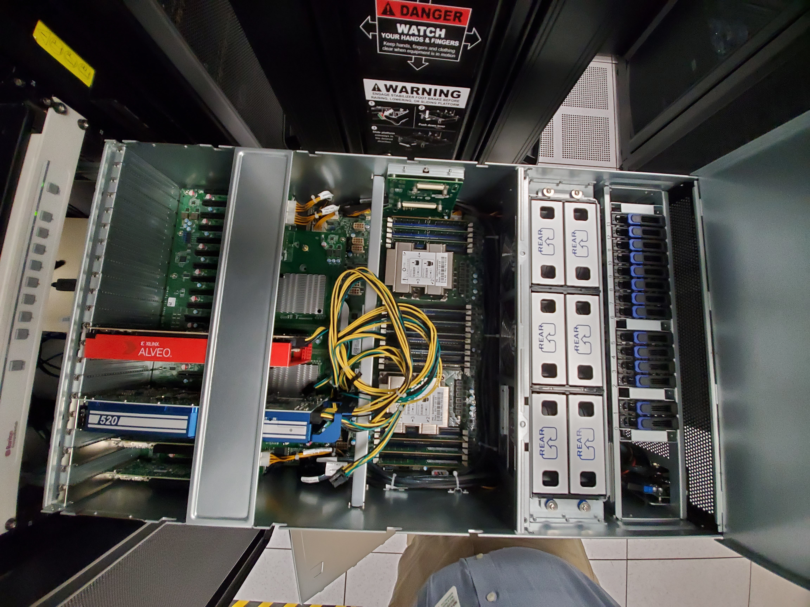
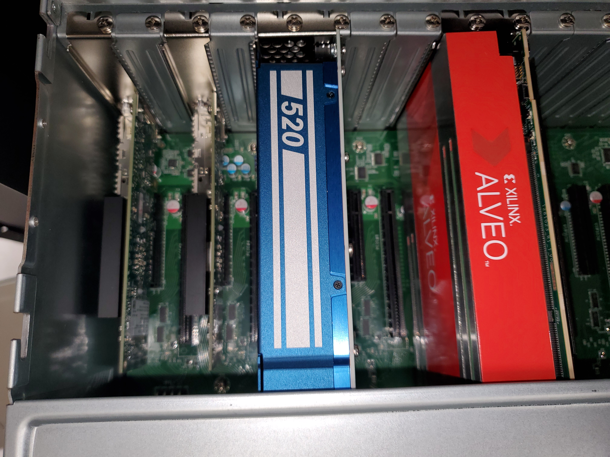
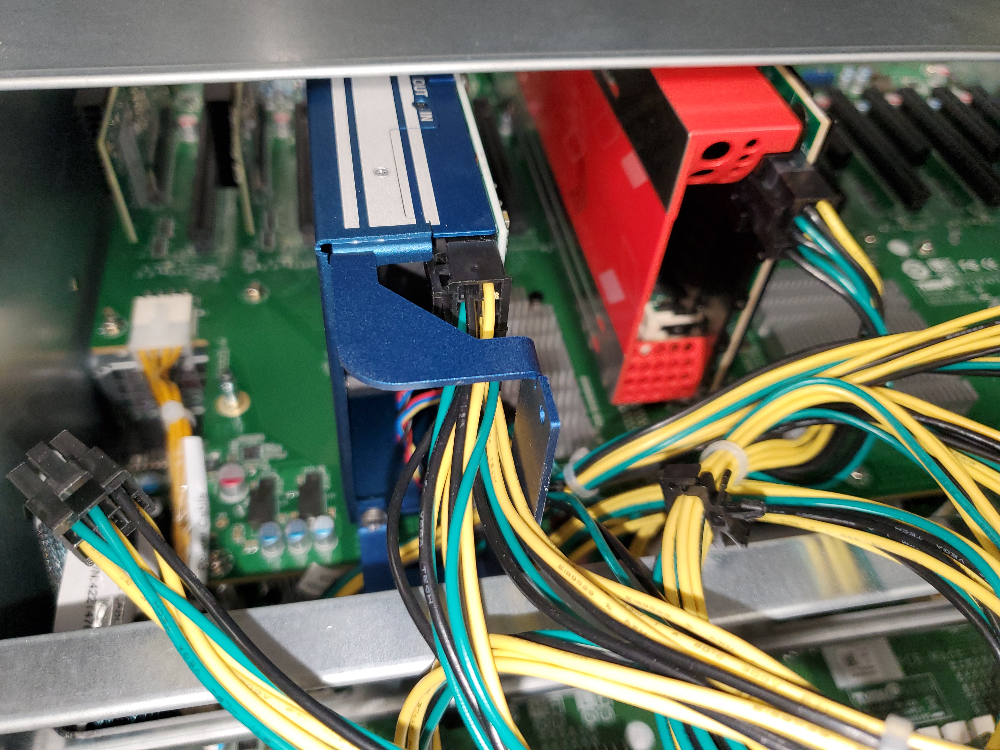
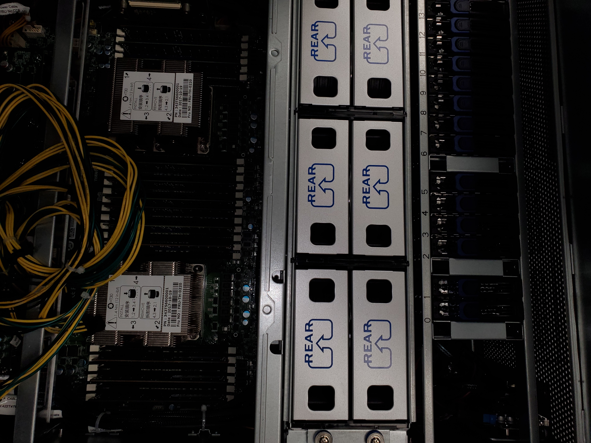

# pcie.ftpn.ornl.gov - development server

## Description

This system is intended for pci-based device support. 

This system is a generic development server purchased with the intent of
housing various development boards as needed.

The system is
*  Atipa 
*  Tyan Motherboard S7119GMR-06
*  192 GB memory
*  Intel(R) Xeon(R) Gold 6130 CPU @ 2.10GHzIntel(R) Xeon(R) Gold 6130 CPU @ 2.10GHz 2x16 cores no hyperthreading
*  Centos

## Access

There is not currently special access permissions.   System is available
to ExCL users.  This may change as needed.

## Images

## Contact
Please send assistance requests to excl-help@ornl.gov.
