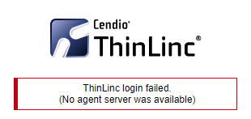

# ThinLinc

The login node has [ThinLinc](https://www.cendio.com/thinlinc/what-is-thinlinc) install and can be accessed at [https://login.excl.ornl.gov:300](https://login.excl.ornl.gov:300). Since this node is public facing, it is the easiest to access with ThinLinc.

In addition to the login node, multiple systems including the [virtual systems](vitis.md#virtual-systems) have [ThinLinc](https://www.cendio.com/thinlinc/what-is-thinlinc) installed, which makes it easier to run graphical applications. To access ThinLinc you need to use port forwarding to forward the ThinLinc ports. The ThinLinc web interface uses the port in the table below and the ThinLinc client uses port 22.


If you run into a "ThinLinc login failed. (No agent server was available)" error, then login to the node with ssh. This will mount your home directory and resolve the ThinLinc error.\
&#x20;


## Ports Used

| Hostname                           | Port | URL                                              |
| ---------------------------------- | ---- | ------------------------------------------------ |
| [Firefly](https://localhost:3200)  | 3200 | [https://localhost:3200](https://localhost:3200) |
| [Intrepid](https://localhost:3201) | 3201 | [https://localhost:3201](https://localhost:3201) |
| [Tardis](https://localhost:3202)   | 3202 | [https://localhost:3202](https://localhost:3202) |
| [Polarden](https://localhost:3203) | 3203 | [https://localhost:3203](https://localhost:3203) |
| [Zenith](https://localhost:3204)   | 3204 | [https://localhost:3204](https://localhost:3204) |
| [Lewis](https://localhost:3205)    | 3205 | [https://localhost:3205](https://localhost:3205) |
| [Clark](https://localhost:3206)    | 3206 | [https://localhost:3206](https://localhost:3206) |
| [pcie](https://localhost:3207)     | 3207 | [https://localhost:3207](https://localhost:3207) |


The URL will only work once port forwarding is set up.\
MobaXTerm can be used to automatically set up port forwarding on launch, which will make the links work when MobaXTerm is running.


## Accessing ThinLinc through the web interface

1.  Forward port from the above list from the remote host to your local system through login.\
    On Linux or macOS, for example

    ```
     $ ssh -L 3200:<hostname>:3200 <Username>@login.excl.ornl.gov
    ```

    On windows use MobaSSHTunnel or Visual Studio Code to forward the port. See [Jupyter Quickstart](jupyter-quick-start.md) for more information on port forwarding in windows.
2. Connect the forwarded port using a web browser. For example: `https://localhost:3200`

## Accessing ThinLinc through ThinLinc Client

This approach is not as recommended as you can't forward a privileged port (i.e., 22) if you are running an ssh server.

1.  Forward port 22 from the remote system to your local system through login. On Linux or macOS

    ```
     $ ssh -L 22:<hostname>:22 <Username>@login.excl.ornl.gov
    ```

    On windows use MobaSSHTunnel or Visual Studio Code to forward port 22. See [Jupyter Quickstart](jupyter-quick-start.md) for more information on port forwarding in windows.
2. Launch the ThinLinc Client.
3. Connect to the server with "Connect".

## Potential Issues you may encounter

If you use Gnome and not have access to the module command when you start 
a terminal session over ThinLinc web, then your terminal session may not be 
configured as a login session.  To resolve

1. Right click on the terminal icon on the left side of your screen
2. In Preferences -> Unnamed, make sure `Run command as a login shell` is checked.

You will then get login processing (including sourcing the /etc/profiles.d files) and so the module command will now be present.

