# Jupyter Notebook

[ExCl](https://docs.excl.ornl.gov) → [User Documentation](../) → [Jupyter Quick Start](jupyter-quick-start.md)

## Accessing a Jupyter Notebook Running on ExCL

A Jupyter notebook server running on ExCL can be accessed via a local web browser through port forwarding the Jupyter notebook's port. By default, this is port 8888 (or the next available port). This port might be in use if someone else is using running a notebook. You can specify the port with the --port flag when launching the Jupyter notebook. To use a different port just replace 8888 with the desired port number. In order to port forward from an internal node, you have to port forward twice, once from your machine to login.excl.ornl.gov and once again from the login node to the internal node (i.e. pcie).

### Detailed instructions for Linux/Mac

These instructions go over how to access a Jupyter notebook running on the pcie node in the ExCL Cluster. If you want to access a different system, then replace `pcie` with the system you want to access.

1.  Specify the ports that you want to use. Choose a different number from the default so that you don't conflict with other users.

    ```
    export REMOTE_PORT=8888
    export LOCAL_PORT=8888
    ```
2.  From your local machine connect to pcie using login.excl.ornl.gov as a proxy and local forward the jupyter port.

    ```
    ssh -L $LOCAL_PORT:localhost:$REMOTE_PORT -J $USER@login.excl.ornl.gov $USER@pcie
    ```

3.  (Optional) Load the anaconda module if you don't have jupyter notebook installed locally.

    ```
    module load anaconda3
    ```
4.  Launch the Jupyter server on pcie

    ```
    export REMOTE_PORT=8888
    jupyter notebook --port $REMOTE_PORT
    ```
5. Connect to the Jupyter notebook using a web browser on your local machine. Use the token shown in the output from running the Jupyter server. Url: `http://localhost:<local_port>/?token=<token>`. You can also configure jupyter to use a password with `jupyter notebook password` if you don't want to use the access tokens.

If you ssh client is too old for proxyjump to work, you can always break up the process into anouther step.

1.  From your local machine connect to login.excl.ornl.gov and local port forward port 8888.

    ```
     $ ssh -L 8888:localhost:8888 <username>@login.excl.ornl.gov
    ```
2.  From the login node connect to pcie and local port forward port 8888

    ```
     $ ssh -L 8888:localhost:8888 pcie
    ```
3.  Launch the Jupyter server on pcie

    ```
     $ jupyter notebook
    ```
4.  Connect to the Jupyter notebook using a web browser on your local machine. Use the token shown in the output from running the Jupyter server. Url: `http://localhost:8888/?token=<token>`

### Detailed instructions for Windows with MobaXterm

These instructions go over how to access a Jupyter notebook running on the pcie node in the ExCL Cluster.

1.  From your local machine connect to login.excl.ornl.gov using MobaXterm.

    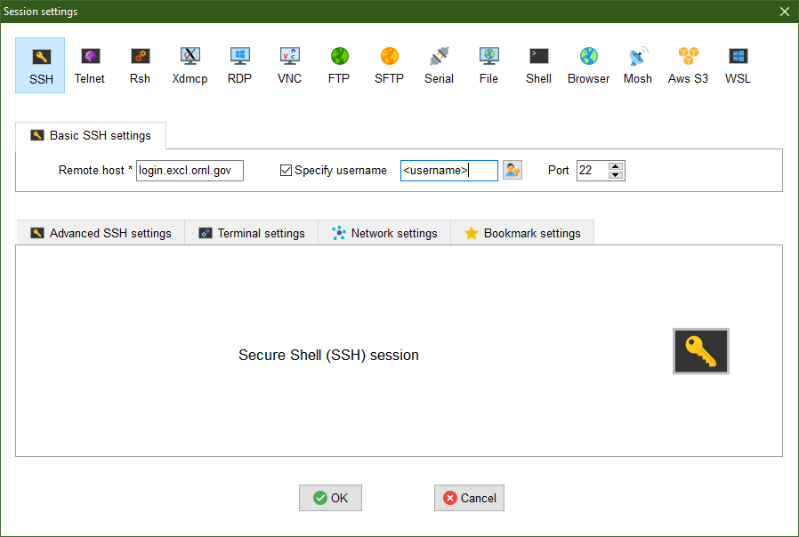
2.  Go to tools and click on MobaSSHTunnel. Use MobaSSHTunnel local forward port 8888.

    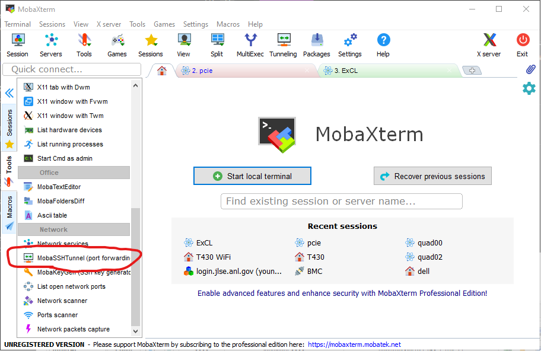

    Click on MobaSSHTunnel

    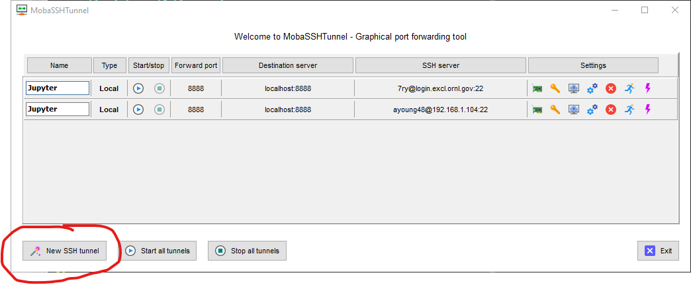

    Click on New SSH Tunnel

    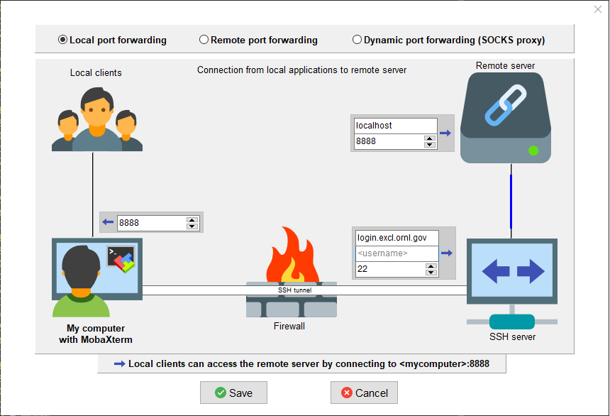

    Local port forward 8888

    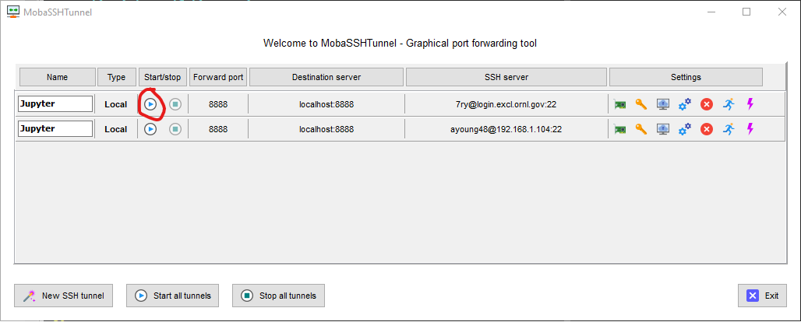

    Click the play button to start port forwarding
3.  From the login node connect to pcie and local port forward port 8888

    ```
     $ ssh -L 8888:localhost:8888 pcie
    ```
4.  Launch the Jupyter server on pcie

    ```
     $ jupyter notebook
    ```
5. Connect to the Jupyter notebook using a web browser on your local machine. Use the token shown in the output from running the Jupyter server. URL: `http://localhost:8888/?token=<token>`

### Detailed instructions for Windows with Visual Studio Code

These instructions go over how to access a Jupyter notebook running on the quad00 node in the ExCL Cluster using Visual Studio Code to handle port forwarding.

1. Open Visual Studio Code
2.  Make sure you have the Remote - SSH extension installed.

    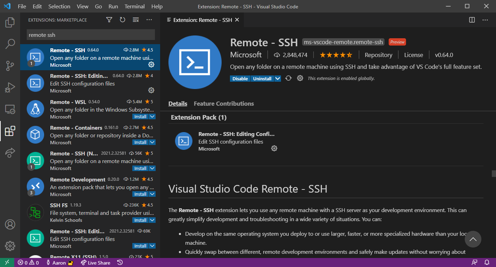
3.  Setup .ssh

    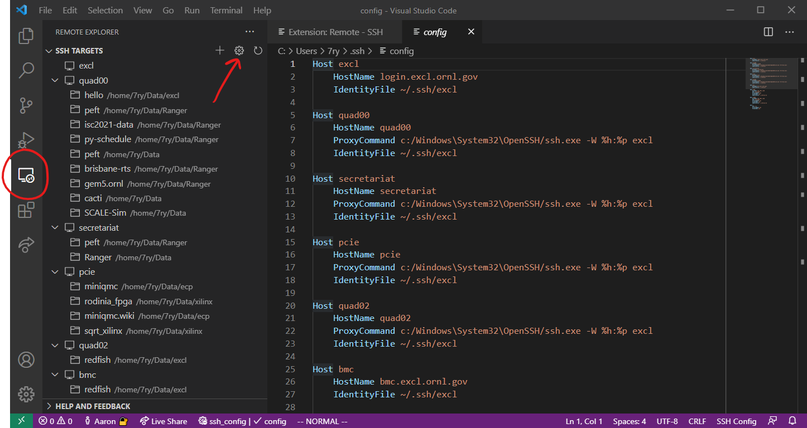

    Navigate to the remote explorer settings.

    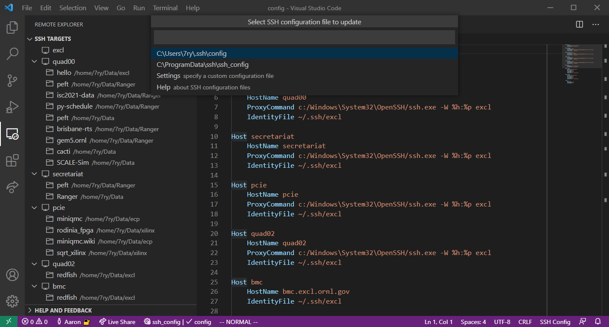

    Chose the user .ssh config.

    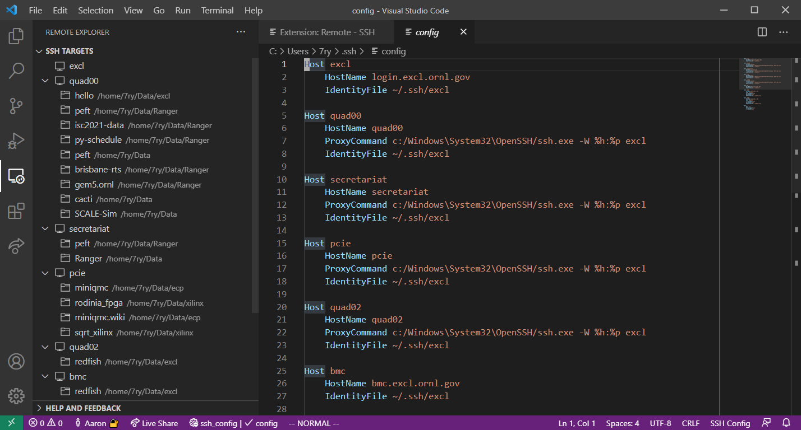

    Add the remote systems to connect to with the proxy command to connect through the login node.
4.  Connect to the remote system and open the Jupyter folder.

    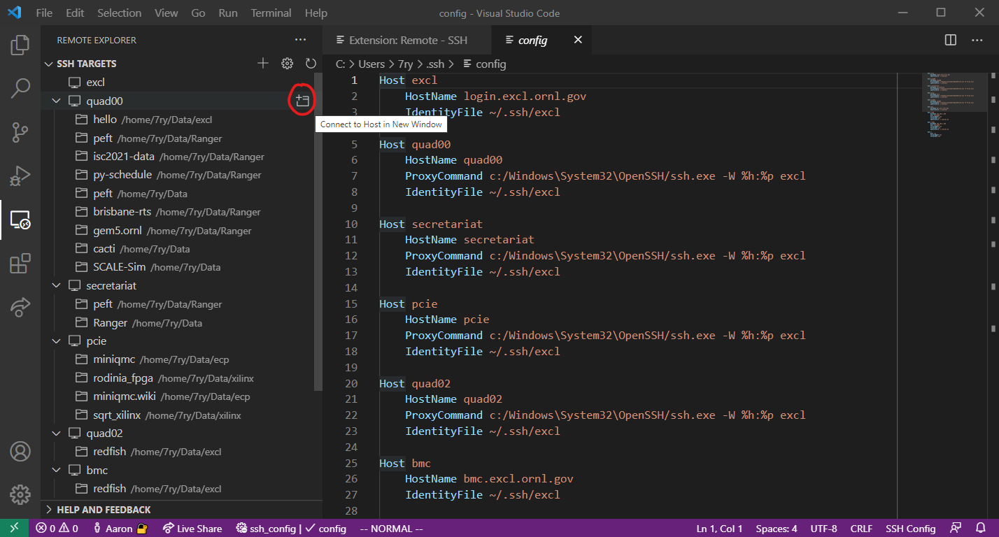

    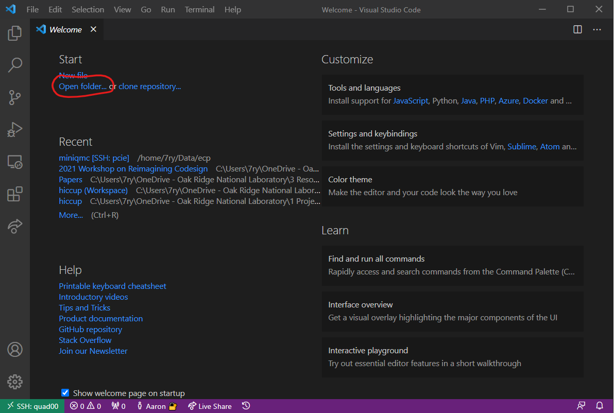

    Open Folder
5.  Run the Jupyter notebook using the built-in terminal.

    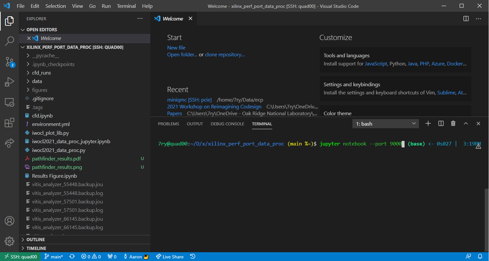
6.  Open the automatically forwarded port.

    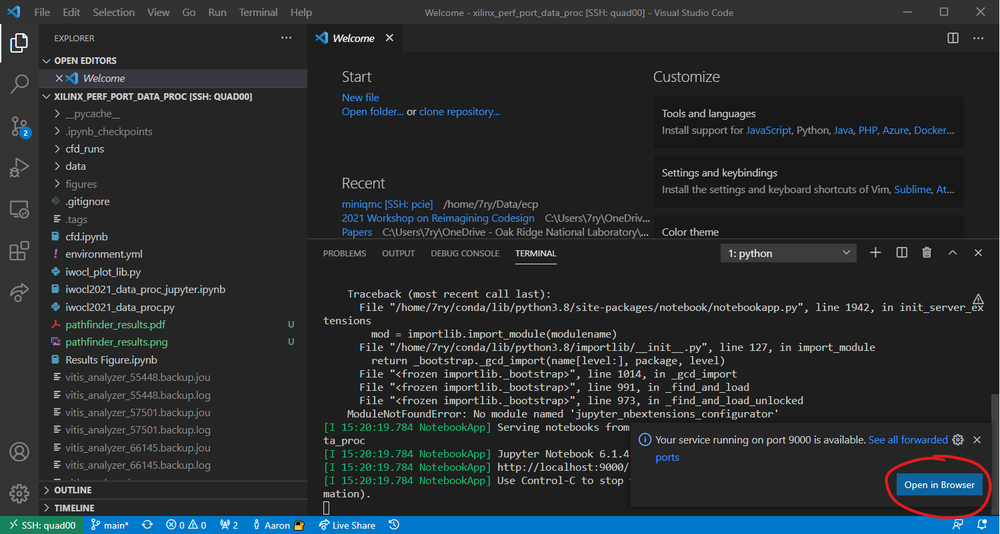

### Using the already installed Anaconda

Anaconda3 is already installed in ExCL as a module and can be used to run Jupyter notebooks. To load the module use `module load anaconda3`. Now you have access to the `jupyter notebook` command.

### Installing Jupyter Notebook with Anaconda

This section is a quick start to installing an anaconda python environment with Jupyter notebook.

1. Follow [Conda and Spack Installation](conda-and-spack-installation.md#installing-conda) to install Conda.
2.  Install Jupyter Notebook.

    ```
     $ conda install -c conda-forge notebook
    ```
