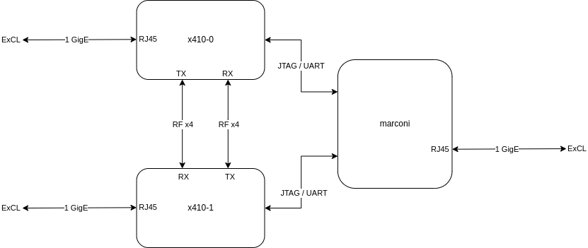

# Ettus USRP X410 Development

The [Ettus USRP X410](https://www.ettus.com/all-products/usrp-x410/) is a high-performance software defined radio (SDR) based on the Xilinx Zynq Ultrascale+ ZU28DR RF System on Chip (RFSoC).

This guide describes how to get started with FPGA and software development for the USRP X410 in ExCL.

## Getting Started



To discover devices that are available on the network:

```shell
$ uhd_find_devices
[INFO] [UHD] linux; GNU C++ version 11.3.0; Boost_107400; UHD_4.4.0.0-0ubuntu1~jammy1
--------------------------------------------------
-- UHD Device 0
--------------------------------------------------
Device Address:
    serial: 3268240
    addr: 10.40.10.133
    claimed: False
    fpga: X4_200
    mgmt_addr: 10.40.10.133
    product: x410
    type: x4xx


--------------------------------------------------
-- UHD Device 1
--------------------------------------------------
Device Address:
    serial: 326A292
    addr: 10.40.10.134
    claimed: False
    fpga: X4_200
    mgmt_addr: 10.40.10.134
    product: x410
    type: x4xx

```

To probe details of a particular device:

```shell
$ uhd_usrp_probe --args mgmt_addr=x410-0
$ uhd_usrp_probe --args mgmt_addr=x410-1
```

To log into the embedded Linux of a device:

```shell
$ ssh root@x410-0
$ ssh root@x410-1
```

To connect to the STM32 SCU:

```shell
screen /dev/serial/by-id/usb-Digilent_Digilent_USB_Device_251635263527-if02-port0 115200
```

To connect to the RFSoC APU:

```shell
sudo screen /dev/serial/by-id/usb-Digilent_Digilent_USB_Device_2516351DDCC0-if03-port0 115200
```

## Development

### USRP Hardware Driver (UHD)

- C++ API
- Python API

### OpenEmbedded Linux

```shell
git clone -b 2.6.3 https://github.com/siemens/kas.git
git clone -b v4.6.0.0 https://github.com/EttusResearch/meta-ettus.git
./kas/kas-container build meta-ettus/kas/x4xx.yml --runtime-args "-e MENDER_ARTIFACT_NAME=v4.6.0.0-excl"
./kas/kas-container shell meta-ettus/kas/x4xx.yml -c "bitbake gnuradio-image -cpopulate_sdk"
./meta-ettus/contrib/create_packages.sh x4xx v4.6.0.0-excl gnuradio-image build/tmp-glibc/deploy
```

### Radio Frequency Network-on-Chip (RFNoC)

Developing a standalone UHD C++ API application...

- [RFNoC Specification](https://files.ettus.com/app_notes/RFNoC_Specification.pdf)

### FPGA

The pre-built FPGA images can be installed with `uhd_image_loader`:

```shell
uhd_image_loader --args type=x4xx,mgmt_addr=x410-0,fpga=X4_200
uhd_usrp_probe --args mgmt_addr=x410-0
```

Building FPGA images for the X410 requires an enterprise license and a specific version of Vivado. The arias machine in ExCL has been configured to support building X410 images.

```shell
ssh arias
cd /noback/$USER
git clone https://github.com/EttusResearch/uhd.git
cd uhd
git checkout -b $USER/develop v4.6.0.0
cd fpga/usrp3/top/x400/
source setupenv.sh --vivado-path=/tools/Xilinx/Vivado
make help
```

Images that use 100G Ethernet requires an additonal no cost license for [Xilinx 100G Ethernet IP](https://www.xilinx.com/products/intellectual-property/cmac_usplus.html). Until this is added to the ExCL license server you can download the license to `~/.Xilinx/Xilinx.lic` or similaer and append it to the `XILINXD_LICENSE_FILE` evironment variable using a colon:

```shell
export XILINXD_LICENSE_FILE=2100@license:$HOME/.Xilinx/Xilinx.lic
```

The default image *X410_X4_200* requires greater then 16 GB of memory (~17 GB peak). Currently arias only has 16 GB of memory so only smaller images like the *X410_X1_100* can be built.

```shell
make X410_X1_100
```

Program the image as follows:

```shell
uhd_image_loader --args type=x4xx,mgmt_addr=x410-0 --fpga-path build/usrp_x410_fpga_X1_100.bit
uhd_usrp_probe --args mgmt_addr=x410-0
```

### Maintanence Notes

See "Getting Started" section for the USRP X4x0 series in the [USRP Hardware Driver and USRP Manual](https://files.ettus.com/manual/page_usrp_x4xx.html).

- Install UHD on the host computer following the [Binary Installation](https://files.ettus.com/manual/page_install.html) instructions
- Also install the python bindings for UHD: `sudo apt-get install python3-uhd`

The versions of the [Module Peripheral Manager (MPM)](https://files.ettus.com/manual/page_mpm.html) running on the RFSoC APU, FPGA image, and UHD on the host must be compatible versions.

```shell
ssh root@x410-0
```

```shell
export ftp_proxy=http://proxy.ftpn.ornl.gov:3128
export http_proxy=http://proxy.ftpn.ornl.gov:3128
export https_proxy=http://proxy.ftpn.ornl.gov:3128
```

```shell
$ sed -i 's/^NTP=.*/NTP=ntp.ftpn.ornl.gov ntp2.ftpn.ornl.gov/' /etc/systemd/timesyncd.conf
$ timedatectl set-ntp true
$ systemctl restart systemd-timesyncd
$ timedatectl set-timezone EST5EDT
$ timedatectl status
$ timedatectl show-timesync
$ timedatectl timesync-status
```

```shell
usrp_update_fs -t v4.6.0.0
```

```shell
ssh-keygen -f "$HOME/.ssh/known_hosts" -R "x410-0"
ssh root@x410-0
mender commit
```

The UHD driver will strongly suggest that the networking subsystem send and recv buffers are sized sufficiently.

```shell
[WARNING] [UDP] The recv buffer could not be resized sufficiently.
Target sock buff size: 2500000 bytes.
Actual sock buff size: 212992 bytes.
See the transport application notes on buffer resizing.
Please run: sudo sysctl -w net.core.rmem_max=2500000

[WARNING] [UDP] The send buffer could not be resized sufficiently.
Target sock buff size: 2500000 bytes.
Actual sock buff size: 212992 bytes.
See the transport application notes on buffer resizing.
Please run: sudo sysctl -w net.core.wmem_max=2500000
```

The UHD package installs a `/etc/sysctl.d/uhd-usrp2.conf` to adjust these settings on boot, but these values are for the older gigabet Ethernet devices and need to be increased.

### References

- [Product Page](https://www.ettus.com/all-products/usrp-x410/)
- [Manual](https://files.ettus.com/manual/page_usrp_x4xx.html)
