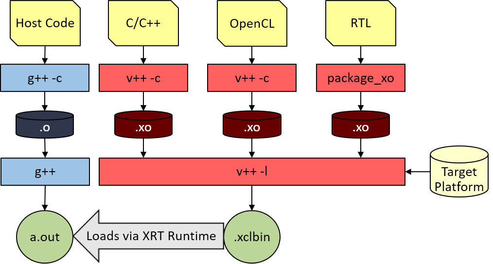

# Vitis FPGA Development

[ExCl](https://docs.excl.ornl.gov) → [User Documentation](../) → [Vitis FPGA Development](vitis.md)

## Vitis Development Tools

This page covers how to access the Vitis development tools available in ExCL. The available FPGAs are listed in the [FPGAs](vitis.md#fpgas) section. The available systems with the Vitis toolchain installed are listed in section [Systems with the Vitis Toolchain](vitis.md#systems-with-the-vitis-toolchain). See [Quickstart](vitis.md#quickstart) to get started. The [virtual systems](vitis.md#virtual-systems) have [ThinLinc](https://www.cendio.com/thinlinc/what-is-thinlinc) installed, which makes it easier to run graphical applications. See section [Accessing ThinLinc](vitis.md#accessing-thinlinc) to get started.

### FPGAs

| FPGA                                                                          | Host System |
| ----------------------------------------------------------------------------- | ----------- |
| [Alveo U250](https://www.xilinx.com/products/boards-and-kits/alveo/u250.html) | pcie        |

### Systems with the Vitis Toolchain

#### Physical Systems

| Name | Tool Chain   | Source File               | Platform Name                 |
| ---- | ------------ | ------------------------- | ----------------------------- |
| pcie | Vitis 2020.1 | \~7ry/vitis-2020.1.source | xilinx\_u250\_xdma\_201830\_2 |

#### Spack based Xilinx build environment on ExCL CentOS systems

All CentOS systems in ExCL cluster are capable to build (only) Xilinx application with Vitis toolchain using Spack environment. Below are the instructions to enable Xilinx development environment in CentOS systems. It is very easy to do this. It enables very fast design space exploration with Slurm support.&#x20;

```bash
$ source  /home/nqx/spack_centos_vitis.source 
```

It has been tested on CentOS systems: affirmed, apachepass, atlanta, excl-us\[00,02-03], justify, kold\[00-03], megatron, newark, oswald, oswald\[00-03], pcie, pharoah, quad\[00-02], secretariat


#### Virtual Systems for Xilinx build and SW and HW emulation run

| Name      | Tool Chain   | Host    | Source File                              | Platform Name                                |
| --------- | ------------ | ------- | ---------------------------------------- | -------------------------------------------- |
| tardis    | Vitis 2020.1 | pcie    | \~7ry/vitis-tardis.source                | xilinx\_u250\_xdma\_201830\_2                |
| torchwood | Vitis 2020.1 | justify | \~7ry/vitis-tardis.source                | xilinx\_u250\_xdma\_201830\_2                |
| firefly   | Vitis 2020.2 | pcie    | /auto/software/vitis/vitis-2020.2.source | xilinx\_u250\_gen3x16\_xdma\_3\_1\_202020\_1 |
| serenity  | Vitis 2020.2 | justify | /auto/software/vitis/vitis-2020.2.source | xilinx\_u250\_gen3x16\_xdma\_3\_1\_202020\_1 |

### Vitis with Slurm (Recommended Method to use Tools)

The Virtual Machines with Vitis installed are also set up with Slurm. Slurm is used as a resource manager to allocate compute resources as well as hardware resources. The use of Slurm is required to allocate FPGA hardware on Firefly and reserve build resources on Serenity. It is also recommended to reserve resources when running test builds on firefly. The best practice is to launch builds on serenity with Slurm, then launch bitfile tests on Firefly with Slurm. The use of Slurm is required to effectively share the FPGA, and to share build resources with automated CI Runs, and other automated build and test scripts. Slurm will automatically set up the Vitis environment and license so that it is ready to use. The rest of this section details how to use Slurm. See the [Cheat Sheet](../#excl-cheat-sheet) for commonly used Slurm commands. See the [Slurm Quick Start User Guide](https://slurm.schedmd.com/quickstart.html) to learn the basics of using Slurm.

#### Interactive Use: Vitis Build

Allocate a build instance for 1 Vitis Build. Each Vitis build uses 8 threads by default. If you plan to use more threads, please adjust -c accordingly.&#x20;

```bash
srun -J interactive_build -p fpgabuild -c 8 --pty bash
```

> Where:\
> &#x20; \-J, --job-name=\<jobname>\
> &#x20; \-p, --partition=\<partition names>\
> &#x20; \-c, --cpus-per-task=\<ncpus>


**Recommended:** `bash` can be replaced with the build or execution command to run the command and get the results back to your terminal. Otherwise, you have to exit the bash shell launched by srun to release the resources.



**Recommended:** `sbatch` can be used with a script to queue the job and store the resulting output to a file. `sbatch` is better than `srun` for long-running builds.&#x20;


#### Interactive Use: Allocate FPGA

Allocate the U250 FPGA to run hardware jobs. Please release the FPGA when you are done so that other jobs can use the FPGA.

```bash
srun -J interactive_fpga -p fpgarun --gres="fpga:U250:1" --pty bash
```

> Where:\
> &#x20; \-J, --job-name=\<jobname>\
> &#x20; \-p, --partition=\<partition names>\
> &#x20; \--`gres="fpga:U250:1"` specifies that you want to use 1 U250 FPGA.


**Recommended:** `bash` can be replaced with the build or execution command to run the command and get the results back to your terminal. Otherwise, you have to exit the bash shell launched by srun to release the resources.


#### Non-interactive Use: Vitis Build

```bash
sbatch -J batch_build -p fpgabuild -c 8 build.sh
```

> Where:\
> &#x20; \-J, --job-name=\<jobname>\
> &#x20; \-p, --partition=\<partition names>\
> &#x20; \-c, --cpus-per-task=\<ncpus>\
> &#x20; build.sh is a script to launch the build.


**Recommended:** The Slurm parameters can be stored in `build.sh` with #SBATCH \<parameter>.


#### Non-interactive Use: Vitis Run

```bash
sbatch -J batch_run -p fpgarun --gres="fpga:U250:1" run.sh
```

> Where:\
> &#x20; \-J, --job-name=\<jobname>\
> &#x20; \-p, --partition=\<partition names>\
> &#x20; \--`gres="fpga:U250:1"` specifies that you want to use 1 U250 FPGA.\
> &#x20; run.sh is a script to launch the run.


**Recommended:** The Slurm parameters can be stored in `build.sh` with #SBATCH \<parameter>.


### Quickstart

1. From the login node run `srun -J interactive_build -p fpgabuild -c 8 --pty bash` to start a bash shell with Vitis ready to go.

### First Steps

1. Follow the [quickstart](vitis.md#quickstart) to set up the [Setting Up the Vitis Environment](vitis.md#setting-up-the-vitis-environment).
2. Go through the [Vitis Getting Started Tutorials](https://github.com/Xilinx/Vitis-Tutorials/tree/master/Getting\_Started).
3. Go through the [Vitis Hardware Accelerators Tutorials](https://github.com/Xilinx/Vitis-Tutorials/tree/master/Hardware\_Accelerators).
4. Go through the [Vitis Accel Examples](https://github.com/Xilinx/Vitis\_Accel\_Examples).

### Getting specific FPGA information from the Platform.

Use [`platforminfo`](https://www.xilinx.com/html\_docs/xilinx2019\_1/sdaccel\_doc/wfa1542666187253.html) to query additional information about an FPGA platform. See the example command below.

```bash
$ platforminfo --platform xilinx_u250_gen3x16_xdma_3_1_202020_1
==========================
Basic Platform Information
==========================
Platform:           gen3x16_xdma_3_1
File:               /opt/xilinx/platforms/xilinx_u250_gen3x16_xdma_3_1_202020_1/xilinx_u250_gen3x16_xdma_3_1_202020_1.xpfm
Description:
    This platform targets the Alveo U250 Data Center Accelerator Card. This high-performance acceleration platform features up to four channels of DDR4-2400 SDRAM which are instantiated as required by
the user kernels for high fabric resource availability, and Xilinx DMA Subsystem for PCI Express with PCIe Gen3 x16 connectivity.


=====================================
Hardware Platform (Shell) Information
=====================================
Vendor:                           xilinx
Board:                            U250 (gen3x16_xdma_3_1)
Name:                             gen3x16_xdma_3_1
Version:                          202020.1
Generated Version:                2020.2
Hardware:                         1
Software Emulation:               1
Hardware Emulation:               1
Hardware Emulation Platform:      0
FPGA Family:                      virtexuplus
FPGA Device:                      xcu250
Board Vendor:                     xilinx.com
Board Name:                       xilinx.com:au250:1.2
Board Part:                       xcu250-figd2104-2L-e

...
```

### Accessing ThinLinc

The [virtual systems](vitis.md#virtual-systems) have [ThinLinc](https://www.cendio.com/thinlinc/what-is-thinlinc) installed, which makes it easier to run graphical applications. To access ThinLinc you need to use port forwarding to forward the ThinLinc ports. The ThinLinc web interface uses port 3200 and the ThinLinc client uses port 22.

#### Ports Used

| Machine  | Port |
| -------- | ---- |
| Firefly  | 3200 |
| Intrepid | 3201 |

#### Accessing ThinLinc through the web interface

1.  Forward port 3200 from the VM to your local system through login.\
    On Linux or macOS

    ```
     $ ssh -L 3200:<VM Name>:3200 <Username>@login.excl.ornl.gov
    ```

    On windows use MobaSSHTunnel or Visual Studio Code to forward port 3200. See [Jupyter Quickstart](jupyter-quick-start.md) for more information on port forwarding in windows.
2. Connect the forwarded port using a web browser. `https://localhost:3200`

#### Accessing ThinLinc through ThinLinc Client

This approach is not as recommended as you can't forward 22 if you are running an ssh server.

1.  Forward port 22 from the VM to your local system through login. On Linux or macOS

    ```
     $ ssh -L 22:<VM Name>:22 <Username>@login.excl.ornl.gov
    ```

    On windows use MobaSSHTunnel or Visual Studio Code to forward port 22. See [Jupyter Quickstart](jupyter-quick-start.md) for more information on port forwarding in windows.
2. Launch the ThinLinc Client.
3. Connect to the server with "Connect".

### Using Vitis with the [Fish Shell](https://fishshell.com)

Fish is installed system-wide with a default configuration based on Aaron's fish configuration that includes helpful functions to launch the Xilinx development tools. The next sections goes over the functions that this fish config provides.

#### vitis\_init

The function is used to set up the Vitis and Vivado toolchains. It is generic enough to find the toolchain on any of the systems on ExCL which have Vitis installed.

#### sfpgabuild

`sfpgabuild` is a shortcut to calling `srun -J interactive_build -p fpgabuild -c 8 --mem 8G --mail-type=END,FAIL --mail-user $user_email --pty $argv` . Essentially it setups a FPGA build environment using slurm using resonable defaults. Each of the defaults can be overriden by spacifying the new parameter when calling `sfpgabuild` . `sfpgabuild` also modifies the prompt to remind you that you are in the fpga build environment.

#### sfpgarun

Similar to `sfpgabuild` , sfpgarun is a shortcut to calling `srun -J interactive_fpga -p fpgarun -c 8 --mem 8G --mail-type=END,FAIL --mail-user $user_email --gres="fpga:U250:1" --pty $argv` . `sfpgarun` setups up an FPGA run environment complete with requesting the FPGA resource.

#### viv

After running `vitis_init`, `sfpgabuild`, or `sfpgarun`, `viv` can be used to launch Vivado in the background and is a shortcut to calling `vivado -nolog -nojournal`.

### Manually Setting up License

In order to manually set up the the Xilinx license, set the environment variable `XILINXD_LICENSE_FILE` to `2100@license.ftpn.ornl.gov`.

```
export XILINXD_LICENSE_FILE=2100@license.ftpn.ornl.gov
```

The FlexLM server uses ports 2100 and 2101.

## Building and Running FPGA Applications

Xilinx FPGA projects can be built using the [Vitis Compiler](https://www.xilinx.com/html\_docs/xilinx2020\_2/vitis\_doc/buildingdevicebinary.html#ariaid-title2), the Vitis GUI, [Vitis HLS](https://www.xilinx.com/html\_docs/xilinx2020\_2/vitis\_doc/buildingdevicebinary.html#xkj1541628747515), or [Vivado](https://www.xilinx.com/html\_docs/xilinx2020\_2/vitis\_doc/buildingdevicebinary.html#ariaid-title6).

In general, I recommend using the Vitis compiler via the command line and scripts, because the workflow is easy to document, store in git, and run with GitLab CI. I recommend using Vitis HLS when trying to optimize kernel since it provides many profiling tools. See [Vitis HLS Tutorial](https://github.com/Xilinx/Vitis-Tutorials/blob/master/Getting\_Started/Vitis\_HLS/synth\_and\_analysis.md).

[Tutorials are available to learn how to use Vitis.](https://github.com/Xilinx/Vitis-Tutorials) In particular, this [Getting started with Vitis Tutorial](https://github.com/Xilinx/Vitis-Tutorials/blob/master/Getting\_Started/Vitis/Part4.md) goes over the building and running of an example application.

**See the** [**Vitis Documentation**](https://www.xilinx.com/html\_docs/xilinx2020\_2/vitis\_doc/xia1553473418160.html) **for more details on building and running FPGA applications.**

### Setting up the Vitis Environment

Vitis source scripts are provided for ExCL which are set up for the particular machine. Source corresponding `Source File` in the system table to load the correct Vitis toolchain environment variables. For example using the Bash:

```bash
source ~7ry/vitis-2020.2.source
```

If you want to use fish instead of bash, then see [Vitis FPGA Development](vitis.md#using-vitis-with-the-fish-shell).

**See the** [**Vitis Documentation**](https://www.xilinx.com/html\_docs/xilinx2020\_2/vitis\_doc/settingupvitisenvironment.html#zks1565446519267) **for more details on setting up the Vitis Environment.**

### Build Targets

There are three build targets available when building an FPGA kernel with Vitis tools.

**See the** [**Vitis Documentation**](https://www.xilinx.com/html\_docs/xilinx2020\_2/vitis\_doc/buildtargets1.html#rst1525720251890) **for more information.**

| Software Emulation                                                  | Hardware Emulation                                                                           | Hardware Execution                                                                     |
| ------------------------------------------------------------------- | -------------------------------------------------------------------------------------------- | -------------------------------------------------------------------------------------- |
| Host application runs with a C/C++ or OpenCL™ model of the kernels. | Host application runs with a simulated RTL model of the kernels.                             | Host application runs with actual hardware implementation of the kernels.              |
| Used to confirm functional correctness of the system.               | Test the host / kernel integration, get performance estimates.                               | Confirm that the system runs correctly and with desired performance.                   |
| Fastest build time supports quick design iterations.                | Best debug capabilities, moderate compilation time with increased visibility of the kernels. | Final FPGA implementation, long build time with accurate (actual) performance results. |

The designed build target is specified with the `-t` flag with `v++`.

### Building the Host Program

The host program can be written using either the native XRT API or OpenCL API calls, and it is compiled using the GNU C++ compiler (`g++`). Each source file is compiled to an object file (`.o`) and linked with the Xilinx runtime (XRT) shared library to create the executable which runs on the host CPU.

**See the** [**Vitis Documentation**](https://www.xilinx.com/html\_docs/xilinx2020\_2/vitis\_doc/buildinghostprogram.html#asy1528754332783) **for more information.**

#### Compiling and Linking for x86


**Important:** Set up the command shell or window as described in [Setting Up the Vitis Environment](vitis.md#setting-up-the-vitis-environment) prior to running the tools.


Each source file of the host application is compiled into an object file (.o) using the `g++` compiler.

```bash
g++ ... -c <source_file1> <source_file2> ... <source_fileN>
```

The generated object files (.o) are linked with the Xilinx Runtime (XRT) shared library to create the executable host program. Linking is performed using the `-l` option.

```bash
g++ ... -l <object_file1.o> ... <object_fileN.o>
```

Compiling and linking for x86 follows the standard `g++` flow. The only requirement is to include the XRT header files and link the XRT shared libraries.

When compiling the source code, the following `g++` options are required:

* `-I$XILINX_XRT/include/`: XRT include directory.
* `-I$XILINX_VIVADO/include`: Vivado tools include directory.
* `-std=c++11`: Define the C++ language standard.

When linking the executable, the following g++ options are required:

* `-L$XILINX_XRT/lib/`: Look in XRT library.
* `-lOpenCL`: Search the named library during linking.
* `-lpthread`: Search the named library during linking.
* `-lrt`: Search the named library during linking.
* `-lstdc++`: Search the named library during linking.


**Note:** In the [Vitis Examples](https://github.com/Xilinx/Vitis\_Accel\_Examples) you may see the addition of xcl2.cpp source file, and the `-I../libs/xcl2` include statement. These additions to the host program and `g++` command provide access to helper utilities used by the example code, but are generally not required for your own code.


### Building the Device Binary

The kernel code is written in C, C++, OpenCL™ C, or RTL, and is built by compiling the kernel code into a Xilinx® object (XO) file, and linking the XO files into a device binary (XCLBIN) file, as shown in the following figure.



The process, as outlined above, has two steps:

1. Build the Xilinx object files from the kernel source code.
   * For C, C++, or OpenCL kernels, the `v++ -c` command compiles the source code into Xilinx object (XO) files. Multiple kernels are compiled into separate XO files.
   * For RTL kernels, the `package_xo` command produces the XO file to be used for linking. Refer to [RTL Kernels](https://www.xilinx.com/html\_docs/xilinx2020\_2/vitis\_doc/devrtlkernel.html#qnk1504034323350) for more information.
   * You can also create kernel object (XO) files working directly in the Vitis™ HLS tool. Refer to [Compiling Kernels with the Vitis HLS](https://www.xilinx.com/html\_docs/xilinx2020\_2/vitis\_doc/buildingdevicebinary.html#yzy1565965133810) for more information.
2. After compilation, the `v++ -l` command links one or multiple kernel objects (XO), together with the hardware platform XSA file, to produce the device binary XCLBIN file.


**TIP:** The `v++` command can be used from the command line, in scripts, or a build system like `make`, and can also be used through the Vitis IDE as discussed in [Using the Vitis IDE](https://www.xilinx.com/html\_docs/xilinx2020\_2/vitis\_doc/won1553474198838.html).



**TIP:** The output directories of `v++` can be changed. See [Vitis Documentation](https://www.xilinx.com/html\_docs/xilinx2020\_2/vitis\_doc/rol1532064542594.html). This is particularly helpful when you want to build multiple versions of the kernel in the same file structure. The [makefile example](vitis.md#example-makefile) shows an example of how to do this.


**See the** [**Vitis Documentation**](https://www.xilinx.com/html\_docs/xilinx2020\_2/vitis\_doc/buildingdevicebinary.html#tvy1528754367816) **for more information.**

#### Compiling Kernels with the Vitis Compiler


**Important:** Set up the command shell or window as described in [Setting Up the Vitis Environment](vitis.md#setting-up-the-vitis-environment) prior to running the tools.


The first stage in building the xclbin file is to compile the kernel code using the Xilinx Vitis compiler. There are multiple `v++` options that need to be used to correctly compile your kernel. The following is an example command line to compile the `vadd` kernel:

```
v++ -t sw_emu --platform xilinx_u200_xdma_201830_2 -c -k vadd \
-I'./src' -o'vadd.sw_emu.xo' ./src/vadd.cpp
```

The various arguments used are described below. Note that some of the arguments are required.

* `-t <arg>`: Specifies the build target, as discussed in [Build Targets](https://www.xilinx.com/html\_docs/xilinx2020\_2/vitis\_doc/buildtargets1.html#rst1525720251890). Software emulation (`sw_emu`) is used as an example. Optional. The default is hw.
* `--platform <arg>`: Specifies the accelerator platform for the build. This is required because runtime features, and the target platform are linked as part of the FPGA binary. To compile a kernel for an embedded processor application, specify an embedded processor platform: `--platform $PLATFORM_REPO_PATHS/zcu102_base/zcu102_base.xpfm`.
* `-c`: Compile the kernel. Required. The kernel must be compiled (`-c`) and linked (`-l`) in two separate steps.
* `-k <arg>`: Name of the kernel associated with the source files.
* `-o'<output>.xo'`: Specify the shared object file output by the compiler. Optional.
* `<source_file>`: Specify source files for the kernel. Multiple source files can be specified. Required.

The above list is a sample of the extensive options available. Refer to [Vitis Compiler Command](https://www.xilinx.com/html\_docs/xilinx2020\_2/vitis\_doc/vitiscommandcompiler.html#wrj1504034328013) for details of the various command-line options. Refer to [Output Directories of the v++ Command](https://www.xilinx.com/html\_docs/xilinx2020\_2/vitis\_doc/rol1532064542594.html) to get an understanding of the location of various output files.

#### Linking the Kernels


**Important:** Set up the command shell or window as described in [Setting Up the Vitis Environment](vitis.md#setting-up-the-vitis-environment) prior to running the tools.


The kernel compilation process results in a Xilinx object (XO) file whether the kernel is written in C/C++, OpenCL C, or RTL. During the linking stage, XO files from different kernels are linked with the platform to create the FPGA binary container file (.xclbin) used by the host program.

Similar to compiling, linking requires several options. The following is an example command line to link the `vadd` kernel binary:

```
v++ -t sw_emu --platform xilinx_u200_xdma_201830_2 --link vadd.sw_emu.xo \
-o'vadd.sw_emu.xclbin' --config ./connectivity.cfg
```

This command contains the following arguments:

* `-t <arg>`: Specifies the build target. Software emulation (`sw_emu`) is used as an example. When linking, you must use the same `-t` and `--platform` arguments as specified when the input (XO) file was compiled.
* `--platform <arg>`: Specifies the platform to link the kernels with. To link the kernels for an embedded processor application, you simply specify an embedded processor platform: `--platform $PLATFORM_REPO_PATHS/zcu102_base/zcu102_base.xpfm`
* `--link`: Link the kernels and platform into an FPGA binary file (xclbin).
* `<input>.xo`: Input object file. Multiple object files can be specified to build into the .xclbin.
* `-o'<output>.xclbin'`: Specify the output file name. The output file in the link stage will be an .xclbin file. The default output name is a.xclbin
* `--config ./connectivity.cfg`: Specify a configuration file that is used to provide `v++` command options for a variety of uses. Refer to [Vitis Compiler Command](https://www.xilinx.com/html\_docs/xilinx2020\_2/vitis\_doc/vitiscommandcompiler.html#wrj1504034328013) for more information on the `--config` option.


**TIP:** Refer to [Output Directories of the v++ Command](https://www.xilinx.com/html\_docs/xilinx2020\_2/vitis\_doc/rol1532064542594.html) to get an understanding of the location of various output files.


Beyond simply linking the Xilinx object (XO) files, the linking process is also where important architectural details are determined. In particular, this is where the number of compute unit (CUs) to instantiate into hardware is specified, connections from kernel ports to global memory are assigned, and CUs are assigned to SLRs. The following sections discuss some of these build options.

### **Analyzing the Build Results**

The Vitis™ analyzer is a graphical utility that allows you to view and analyze the reports generated while building and running the application. It is intended to let you review reports generated by both the Vitis compiler when the application is built, and the Xilinx® Runtime (XRT) library when the application is run. The Vitis analyzer can be used to view reports from both the `v++` command line flow, and the Vitis integrated design environment (IDE). You will launch the tool using the `vitis_analyzer` command (see [Setting Up the Vitis Environment](vitis.md#setting-up-the-vitis-environment)).

**See the** [**Vitis Documentation**](https://www.xilinx.com/html\_docs/xilinx2020\_2/vitis\_doc/jfn1567005096685.html) **for more information.**

### **Running Emulation**

TLDR: Create an `emconfig.json` file using `emconfigutil` and set `XCL_EMULATION_MODE` to `sw_emu` or `hw_emu` before executing the host program. The device binary also has to be built for the corresponding target.

**See the** [**Vitis Documentation**](https://www.xilinx.com/html\_docs/xilinx2020\_2/vitis\_doc/runemulation1.html#btg1600442263101) **for more information.**

#### Running Emulation on Data Center Accelerator Cards


**Important:** Set up the command shell or window as described in [Setting Up the Vitis Environment](vitis.md#setting-up-the-vitis-environment) prior to running the tools.


1.  Set the desired runtime settings in the xrt.ini file. This step is optional.\


    As described in [xrt.ini File](https://www.xilinx.com/html\_docs/xilinx2020\_2/vitis\_doc/obl1532064985142.html), the file specifies various parameters to control debugging, profiling, and message logging in XRT when running the host application and kernel execution. This enables the runtime to capture debugging and profile data as the application is running. The `Emulation` group in the xrt.ini provides features that affect your emulation run. \
    \
    **TIP:** Be sure to use the `v++ -g` option when compiling your kernel code for emulation mode.\

2.  Create an emconfig.json file from the target platform as described in [emconfigutil Utility](https://www.xilinx.com/html\_docs/xilinx2020\_2/vitis\_doc/nrj1570599837825.html). This is required for running hardware or software emulation.\


    The emulation configuration file, `emconfig.json`, is generated from the specified platform using the `emconfigutil` command, and provides information used by the XRT library during emulation. The following example creates the `emconfig.json` file for the specified target platform:

    ```
    emconfigutil --platform xilinx_u200_xdma_201830_2
    ```

    In emulation mode, the runtime looks for the emconfig.json file in the same directory as the host executable, and reads in the target configuration for the emulation runs.\
    \
    **TIP:** It is mandatory to have an up-to-date JSON file for running emulation on your target platform.\

3.  Set the `XCL_EMULATION_MODE` environment variable to `sw_emu` (software emulation) or `hw_emu` (hardware emulation) as appropriate. This changes the application execution to emulation mode.\


    Use the following syntax to set the environment variable for C shell (csh):

    ```
    setenv XCL_EMULATION_MODE sw_emu
    ```

    Bash shell:

    ```
    export  XCL_EMULATION_MODE=sw_emu
    ```

    **IMPORTANT:** The emulation targets will not run if the `XCL_EMULATION_MODE` environment variable is not properly set.\

4.  Run the application.\


    With the runtime initialization file (xrt.ini), emulation configuration file (emconfig.json), and the `XCL_EMULATION_MODE` environment set, run the host executable with the desired command line argument.\
    \
    **IMPORTANT:** The INI and JSON files must be in the same directory as the executable.\


    For example:

    ```
    ./host.exe kernel.xclbin
    ```

    **TIP:** This command line assumes that the host program is written to take the name of the xclbin file as an argument, as most Vitis examples and tutorials do. However, your application may have the name of the xclbin file hard-coded into the host program, or may require a different approach to running the application.

### Running the Application Hardware Build

TLDR: Make sure `XCL_EMULATION_MODE`  is unset. Use a node with the FPGA hardware attached.

**See the** [**Vitis Documentation**](https://www.xilinx.com/html\_docs/xilinx2020\_2/vitis\_doc/lwu1600468728254.html) **for more information.**


**TIP:** To use the accelerator card, you must have it installed as described in Getting Started with Alveo Data Center Accelerator Cards ([UG1301](https://www.xilinx.com/cgi-bin/docs/bkdoc?v=latest;k=accelerator-cards;d=ug1301-getting-started-guide-alveo-accelerator-cards.pdf)).


1.  Edit the xrt.ini file as described in [xrt.ini File](https://www.xilinx.com/html\_docs/xilinx2020\_2/vitis\_doc/obl1532064985142.html).\
    ****

    This is optional, but recommended when running on hardware for evaluation purposes. You can configure XRT with the xrt.ini file to capture debugging and profile data as the application is running. To capture event trace data when running the hardware, refer to [Enabling Profiling in Your Application](https://www.xilinx.com/html\_docs/xilinx2020\_2/vitis\_doc/profilingapplication.html#vfc1586356138757). To debug the running hardware, refer to [Debugging During Hardware Execution](https://www.xilinx.com/html\_docs/xilinx2020\_2/vitis\_doc/debuggingapplicationskernels.html#hsr1538574456889).\
    \
    **TIP:** Ensure to use the `v++ -g` option when compiling your kernel code for debugging.\

2. Unset the `XCL_EMULATION_MODE` environment variable.\
   \
   **IMPORTANT:** The hardware build will not run if the `XCL_EMULATION_MODE` environment variable is set to an emulation target.\

3.  For embedded platforms, boot the SD card.\
    \
    **TIP:** This step is only required for platforms using Xilinx embedded devices such as Versal ACAP or Zynq UltraScale+ MPSoC.\


    For an embedded processor platform, copy the contents of the ./sd\_card folder produced by the `v++ --package` command to an SD card as the boot device for your system. Boot your system from the SD card.\

4.  Run your application.\


    The specific command line to run the application will depend on your host code. A common implementation used in Xilinx tutorials and examples is as follows:

    ```
    ./host.exe kernel.xclbin
    ```


**TIP:** This command line assumes that the host program is written to take the name of the xclbin file as an argument, as most Vitis examples and tutorials do. However, your application can have the name of the xclbin file hard-coded into the host program, or can require a different approach to running the application.


### Example Makefile

A simple example Vitis project is available at [https://code.ornl.gov/7ry/add\_test](https://code.ornl.gov/7ry/add\_test). This project can be used to test the Vitis compile chain and [Vitis HLS](https://www.xilinx.com/html\_docs/xilinx2020\_2/vitis\_doc/gnq1597858079367.html)

The [makefile](https://code.ornl.gov/7ry/add\_test/-/blob/main/Makefile) used by this project is an example of how to create a makefile to build an FPGA accelerated application.

```bash
HW_TARGET ?= sw_emu # [sw_emu, hw_emu, hw]
LANGUAGE ?= opencl # [opencl, xilinx]
VERSION ?= 1 # [1, 2, 3]

#HWC stands for hardware compiler
HWC = v++
TMP_DIR = _x/$(HW_TARGET)/$(LANGUAGE)/$(VERSION)
src_files = main_xilinx.cpp cv_opencl.cpp double_add.cpp
hpp_files = cv_opencl.hpp double_add.hpp
KERNEL_SRC = kernels/add_kernel_v$(VERSION).cl
COMPUTE_ADD_XO = $(HW_TARGET)/$(LANGUAGE)/xo/add_kernel_v$(VERSION).xo
XCLBIN_FILE = $(HW_TARGET)/$(LANGUAGE)/add_kernel_v$(VERSION).xclbin

ifeq ($(LANGUAGE), opencl)
    KERNEL_SRC = kernels/add_kernel_v$(VERSION).cl
else
    KERNEL_SRC = kernels/add_kernel_v$(VERSION).cpp
endif

.PHONY: all kernel
all: double_add emconfig.json $(XCLBIN_FILE)
build: $(COMPUTE_ADD_XO)
kernel: $(XCLBIN_FILE)

double_add: $(src_files) $(hpp_files)
    g++ -Wall -g -std=c++11 $(src_files) -o $@ -I../common_xlx/ \
    -I${XILINX_XRD}/include/ -L${XILINX_XRT}/lib/ -L../common_xlx -lOpenCL \
    -lpthread -lrt -lstdc++

emconfig.json:
    emconfigutil --platform xilinx_u250_gen3x16_xdma_3_1_202020_1 --nd 1

$(COMPUTE_ADD_XO): $(KERNEL_SRC)
    $(HWC) -c -t $(HW_TARGET) --kernel double_add --temp_dir $(TMP_DIR) \
    --config design.cfg -Ikernels -I. $< -o $@

$(XCLBIN_FILE): $(COMPUTE_ADD_XO)
    $(HWC) -l -t $(HW_TARGET) --temp_dir $(TMP_DIR) --config design.cfg \
    --connectivity.nk=double_add:1:csq_1 \
    $^ -I. -o $@

.PHONY: clean
clean:
    rm -rf double_add emconfig.json xo/ built/ sw_emu/ hw_emu/ hw/ _x *.log .Xil/
```

### Performance Considerations

Vitis and Vivado will use 8 threads by default on Linux. Many of the Vivado tools can only utilize 8 threads for a given task. See the Multithreading in the Vivado Tools section from [Vivado Design Suite User Guide Implementation (UG904)](https://www.xilinx.com/support/documentation/sw\_manuals/xilinx2020\_2/ug904-vivado-implementation.pdf). I found from experimenting that the block level synthesis task can leverage more than 8 threads, but will not do so unless you set the vivado.synth.jobs and vivado.impl.jobs flags.&#x20;

Here is an example snippet from the [Xilinx Buttom-Up RTL Tutorial](https://github.com/Xilinx/Vitis-Tutorials/blob/2020.2/Hardware\_Accelerators/Design\_Tutorials/05-bottom\_up\_rtl\_kernel/krnl\_cbc/Makefile) which shows one way to query and set the number of CPUs to use.

```bash
NCPUS := $(shell grep -c ^processor /proc/cpuinfo)
JOBS := $(shell expr $(NCPUS) - 1)

XOCCFLAGS := --platform $(PLATFORM) -t $(TARGET)  -s -g
XOCCLFLAGS := --link --optimize 3 --vivado.synth.jobs $(JOBS) --vivado.impl.jobs $(JOBS)
# You could uncomment following line and modify the options for hardware debug/profiling
#DEBUG_OPT := --debug.chipscope krnl_aes_1 --debug.chipscope krnl_cbc_1 --debug.protocol all --profile_kernel data:all:all:all:all

build_hw:
	v++ $(XOCCLFLAGS) $(XOCCFLAGS) $(DEBUG_OPT) --config krnl_cbc_test.cfg -o krnl_cbc_test_$(TARGET).xclbin krnl_cbc.xo ../krnl_aes/krnl_aes.xo

```

## Useful References

* [Vitis Unified Software Development Platform 2020.2 Documentation](https://www.xilinx.com/html\_docs/xilinx2020\_2/vitis\_doc/index.html)
* [Vivado Design Suite User Guide (UG892)](https://www.xilinx.com/support/documentation/sw\_manuals/xilinx2018\_2/ug892-vivado-design-flows-overview.pdf)
* [Xilinx Vivado Design Suite Quick Reference Guide (UG975)](https://www.xilinx.com/support/documentation/sw\_manuals/xilinx2013\_2/ug975-vivado-quick-reference.pdf)
* [Vivado Design Suite Tcl Command Reference Guide (UG835)](https://www.xilinx.com/support/documentation/sw\_manuals/xilinx2019\_2/ug835-vivado-tcl-commands.pdf)
* [Vivado Design Suite User Guide Implementation (UG904)](https://www.xilinx.com/support/documentation/sw\_manuals/xilinx2020\_2/ug904-vivado-implementation.pdf)

## Useful Commands

```bash
xbutil validate  # Validate installation of the card.
xbutil scan      # Scan for availible FPGAs.
xbutil query     # Query detailed information from the FPGA.
xbutil program   # Download the accelerator program. Good for testing bitfile load.
xbutil reset     # Reset the FPGA, used when kernel is unresponsive.

platforminfo --platform <platform_file> # Get specific FPGA information from the Platform.
```
