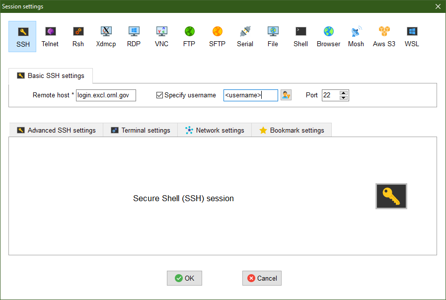

[ExCl](https://docs.excl.ornl.gov) → [User Documentation](../README.md) → [Jupyter Quick Start](jupyter-quick-start.md)

# Accessing a Jupyter Notebook Running on ExCL

A Jupyter notebook server running on ExCL can be accessed via a local web browser through port forwarding the Jupyter notebook's port. By default this is port 8888 (or the next available port). This port might be in use if someone else is using running a notebook. You can specify the port with the --port flag when launching the jupyter notebook. To use a different port just replace 8888 with the desired port number. In order to port forward from an internal node, you have to port forward twice, once from your machine to login.excl.ornl.gov and once again from the login node to the internal node (i.e. pcie).

## Detailed instructions for Linux/Mac:

These instructions go over how to access a jupyter notebook running on the pcie node in the ExCL Cluster.

1. From your local machine connect to login.excl.ornl.gov and local port forward port 8888.

        $ ssh -L 8888:localhost:8888 <username>@login.excl.ornl.gov

2. From the login node connect to pcie and local port forward port 8888

        $ ssh -L 8888:localhost:8888 pcie

3. Launch the Jupyter server on pcie
     
        $ jupyter notebook

4. Connect to the jupyter notebook using a web browser on your local machine. Use the token shown in the output from running the jupyter server.  
Url: `http://localhost:8888/?token=<token>`

## Detailed instructions for Windows with MobaXterm

These instructions go over how to access a Jupyter notebook running on the pcie node in the ExCL Cluster.

1. From your local machine connect to login.excl.ornl.gov using MobaXterm.

2. Go to tools and click on MobaSSHTunnel. Use MobaSSHTunnel local forward port 8888.  
  
Click on MobaSSHTunnel  
  
Click on New SSH Tunnel  
  
Local port forward 8888  
  
Click the play button to start port forwarding

3. From the login node connect to pcie and local port forward port 8888

        $ ssh -L 8888:localhost:8888 pcie

4. Launch the Jupyter server on pcie

        $ jupyter notebook

5. Connect to the jupyter notebook using a web browser on you local machine. Use the token shown in the output from running the jupyter server.  
url: `http://localhost:8888/?token=<token>`

## Detailed instructions for Windows with Visual Studio Code

These instructions go over how to access a jupyter notebook running on the quad00 node in the ExCL Cluster using Visual Studio Code to handle port forwarding.

1. Open Visual Studio Code

2. Make sure you have the Remote - SSH extension installed.

3. Setup .ssh
  
Navigate to the remote explorer settings.  
  
Chose the user .ssh config.  
  
Add the remote systems to connect to with the proxy command to connect through the login node.

4. Connect to the remote system and open the Jupyter folder.
  
  
Open Folder

5. Run the Jupyter notebook using the built in terminal.  

6. Open the automatically forwarded port.  

## Installing Jupyter Notebook with Anaconda

This section is a quick start to installing an anaconda python environment with jupyter notebook.

1. Download Anaconda installer.

        $ wget https://repo.anaconda.com/archive/Anaconda3-2020.11-Linux-x86_64.sh

2. Run the installer

        $ bash Anaconda3-2020.11-Linux-x86_64.sh

3. Install Jupyter.

        $ conda install -c conda-forge notebook
