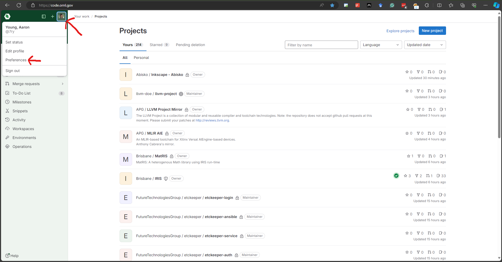
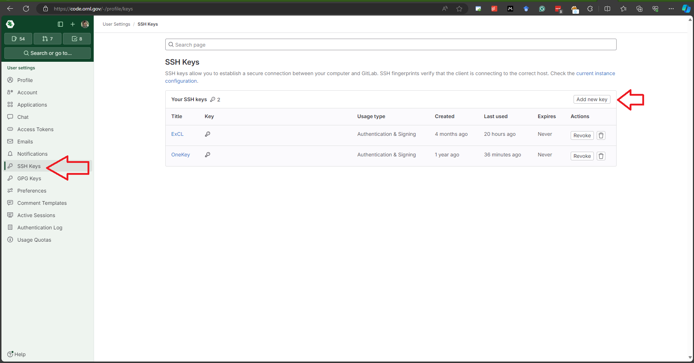

# Git

Git (code revision management system) is installed on all ExCL systems on which it makes sense. Git operates as expected, except for external access.

If you require access to external git resources, you need to do a little more.

## HTTP or HTTPS access

For HTTP or HTTPS access, make sure you have the following environment variables\
(they should be set by default, but may not be if you have altered your environment)

```bash
http_proxy=http://proxy.ftpn.ornl.gov:3128
https_proxy=http://proxy.ftpn.ornl.gov:3128
```

The proxy server has access to the full Oak Ridge network (open research only).

## Git SSH Access

ssh can be used to clone repositories on the login node. In order to clone repositories on the internal nodes, the ssh config needs to be changed to use the login node as a proxy jump. Here is an example ssh config with jump proxies to code.ornl.gov, bitbucket.org, and github.com.

```config
Host code.ornl.gov bitbucket.org github.com
   ProxyJump login
```

To configure git to always use ssh for code.ornl.gov repositories, use the config command below.

```bash
git config --global url."git@code.ornl.gov:".insteadOf https://code.ornl.gov/
```

## Setup Git access to [code.ornl.gov](https://code.ornl.gov)

The recommended approach to access `code.ornl.gov` is to use SSH. To do this, you need to generate an SSH key and add it to your GitLab account. The following steps will guide you through the process.

1. Generate an SSH key.

```bash
ssh-keygen
```

2. Add the SSH key to your GitLab account.

```bash
cat ~/.ssh/id_rsa.pub
```

3. Copy the output of the command and paste it into the SSH key section of your GitLab account settings.  
    
    

4. If you are on an ExCL system and you have not already done so, configure your SSH client to use the login node as a jump proxy. See [Git SSH Access](#git-ssh-access) for more information.

If you use a passphrase with your SSH key (recommended for security), then you should also setup an SSH Agent to load the SSH key. This allows you to enter your passphrase once for the session without needing to enter your passphrase potentially many times for each git command. The VS Code documentation is well written for setting up this SSH Agent on a variety of platforms, see [Visual Studio Code Remote Development Troubleshooting Tips and Tricks](https://code.visualstudio.com/docs/remote/troubleshooting#_setting-up-the-ssh-agent).

## SSH Keys for Authentication

Using SSH keys is the preferred way to authenticate your user and to authenticate with private Git repositories. For security, it is recommended to use an SSH keys encrypted with a passphrase.

### Why not passwords?

ExCL will block your account after 3 failed attempts. Automatic login tools, e.g. VS Code, can easily exceed this limit using a cached password and auto-reconnect.
For git repos with two-factor authentication, an application token/password must be created, and this password must be stored externally and is more cumbersome to use.

### How to get started?

1. Set up a key pair:
    - [Visual Studio Code Remote Development Troubleshooting Tips and Tricks](https://code.visualstudio.com/docs/remote/troubleshooting#_quick-start-using-ssh-keys)
    - [Generating a new SSH key and adding it to the ssh-agent - GitHub Docs](https://docs.github.com/en/authentication/connecting-to-github-with-ssh/generating-a-new-ssh-key-and-adding-it-to-the-ssh-agent)
2. [Add key to Git Hosting Websites.](https://docs.excl.ornl.gov/software/git#setup-git-access-to-code.ornl.gov) Add the key to all Git hosting website that you want to use.
3. [Setup ExCL worker node proxy via login node.](https://docs.excl.ornl.gov/software/git#git-ssh-access)

## SSH-Agent and SSH Forwarding

**SSH-Agents** cache SSH keys with passphrases, allowing them to be reused during the session.
This is not needed with keys without a passphrase, since they can be used without decrypting.

**SSH Forwarding:** SSH agents can forward SSH keys to a remote system, making the keys available there as well.

### How to get started?

1. [Set up an SSH-Agent](https://code.visualstudio.com/docs/remote/troubleshooting).
2. Add key to agent
    - `ssh-add` or `ssh-add [file]` for non-default filenames.
    - Note: If you're running a mac and want to add an SSH key that's not one of the standard names (`~/.ssh/id_rsa, ~/.ssh/id_ecdsa, ~/.ssh/id_ecdsa_sk, ~/.ssh/id_ed25519, ~/.ssh/id_ed25519_sk, and ~/.ssh/id_dsa`)
      use  
    ```
    ssh-add --apple-use-keychain [file]
    ```
    - Check loaded keys with `ssh-add –l`.
3. Setup SSH forwarding in SSH config.  
    ```config
    Host *
        ForwardAgent yes
    ```  
    - Log in and verify key is still available.


**Warning:** Do not launch an SSH-agent on the remote system when using SSH Forwarding, as the new agent will hide the forwarded keys.

