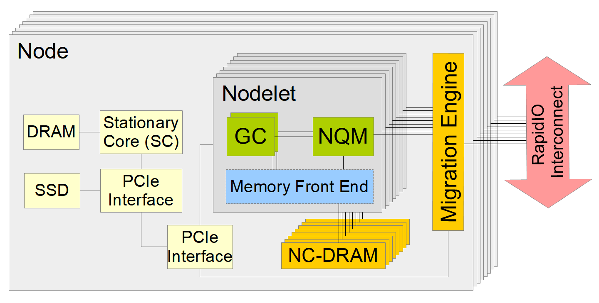

# emu

## Description

EMU-Chick System is composed of 8x nodes that are connected via RapidIO Interconnect.

Each node has:

* 8x nodelets, array of DRAMs
* A stationary core \(SC\)
* Migration engine, PCI-Express interfaces, and an SSD. 
* 64-byte channel 64GB of DRAM, divided into eight 8-byte narrow-channel-DRAMs \(NC-DRAM

Each nodelet has:

* 2x Gosamer cores \(GC\)
* 64 concurrent in-order, single-issue hardware threads

## Access

* The path to access to each individual EMU node is: `login.excl.ornl.gov` ⇒ `emu-gw` ⇒ `emu` ⇒ {`n0`-`n7`}
* `emu-gw` is an x86-based gateway node.
* The `emu` is the system board controller \(sbc\) and individual nodes are accessed only via this host.
* Connections to `emu` from the `emu-gw` are via preset ssh keys that are created during account creation. If you can't log in, your user account/project do not have access to EMU systems.

## Development Workflow

* The EMU software development kit \(SDK\) is installed under /usr/local/emu on emu-gw, which is an x86 based system. Compilation and simulation should be performed on this machine.
* The official EMU programming guide is located under /usr/docs.
* emu and emu-gw mount home directories, so you should have no difficulty accessing your projects. Please use `$HOME` \(or `${HOME}`\) as your home directory in scripts, as the mount location of your home directory, may change.

## Other Resources

This document will be updated with additional documentation references and user information as it becomes available.

## Contact

Please send assistance requests to excl-help@ornl.gov.

