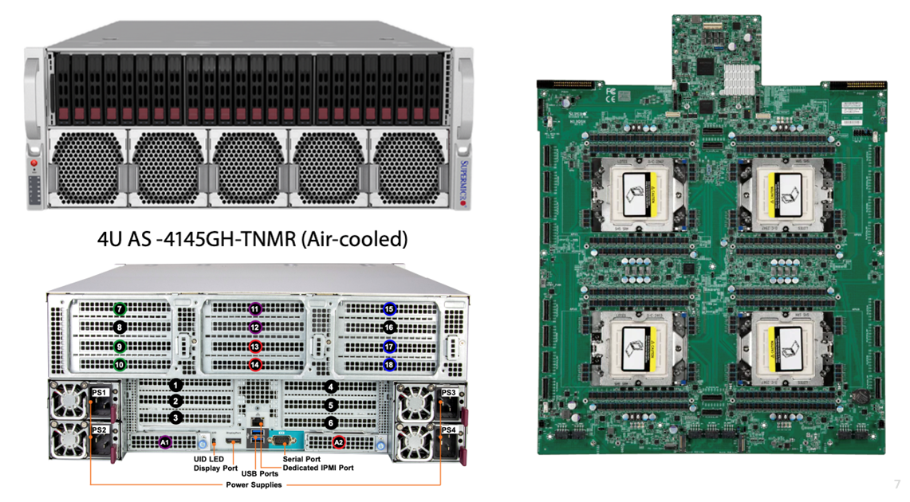

# faraday

The MI300A system (host name **faraday**) is available for ExCL users.  As usual you have to log in through the login node.

Make sure that you

```bash
module load rocmmod
```

to set up all of the environment needed.

A very light test program is available via git at [https://github.com/jungwonkim/amd-toy](https://urldefense.us/v2/url?u=https-3A__github.com_jungwonkim_amd-2Dtoy&d=DwMF-g&c=v4IIwRuZAmwupIjowmMWUmLasxPEgYsgNI-O7C4ViYc&r=RnGksEeP8Hnu8nrJCbLZAjs5T2iFaJmtp2eby7VLkxA&m=knZGfFbGR9xeA5K76rfwtUnSGQIyd5Vxf-49LDTi8CMaJbk9YdUHm1KWP9knXE31&s=S0bot54rkCup-PwSwYOI0XK506fO4ytzprrozV5jc2M&e=).  This is a good way to ensure your environment is set up correctly.

All tests should return `err[0]`.  If they do not, then it is likely that you do not have render group permissions

To check, run the groups command (on faraday) and see if you are in the render group.

If you are not, contact [help@excl.ornl.gov](mailto:help@excl.ornl.gov), and we’ll get you in.

## System Information

- Supermicro AS -4145GH-TNMR
    - No configuration options wrt memory or other addons.
- 4 APU (Accelerated Processing Unit) (combined CPU, GPU and HBM3 memory)
    - 912 CDNA 3 GPU units
    - 96 Zen 4 cores
    - 512 GB unified HBM3 (128 per APU)
- Supermicro designed and built system (we have 4U air cooled, also available as 2U liquid cooled)
    - Rather than the normal PCIe 5.0 slots, riser cards that connect into specialized backplane connectors are used (but they are PCIe 5.0).
        - To add hardware we will need to purchase riser cards, and lots of heads up time
- Ubuntu 24.04 LTS;  ROCM 6.0.4

## Documentation

- Available models: [https://www.supermicro.com/en/accelerators/amd](https://www.supermicro.com/en/accelerators/amd)
- Datasheet on Faraday: [https://www.supermicro.com/datasheet/datasheet_H13_QuadAPU.pdf](https://www.supermicro.com/datasheet/datasheet_H13_QuadAPU.pdf)
- Hardware documentation: [https://www.supermicro.com/manuals/superserver/4U/MNL-2754.pdf](https://www.supermicro.com/manuals/superserver/4U/MNL-2754.pdf)

### Images


