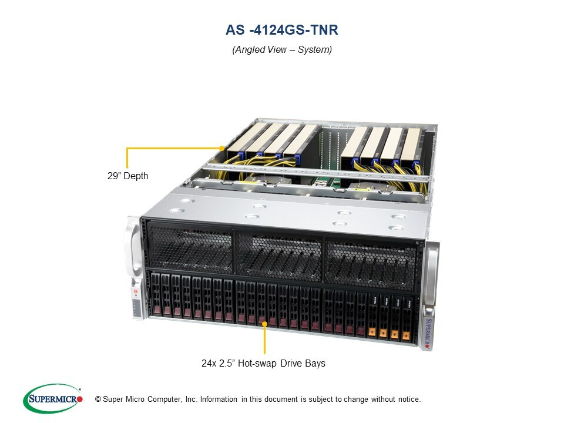

# maxwell

Maxwell is a SuperMicro AS-4124-GS-TNR chassis with 256 HT Cores (2 sockets with 64 cores/socket and 2 threads/core) based on the AMD EPYC 7763 64-Core Processor, and 1 TB main memory. It has 3 TB nvme scratch storage.

This system has four Nvidia A100-PCIE-40GB GPUs and four AMD Instinct MI100 GPUs.   

The ROCM development environment does not require a module load; it is installed in system space.

For Nvidia:

```bash
module load nvhpc
```
to set up all of the environment needed.

A very light test program is available via git at [https://github.com/jungwonkim/amd-toy](https://urldefense.us/v2/url?u=https-3A__github.com_jungwonkim_amd-2Dtoy&d=DwMF-g&c=v4IIwRuZAmwupIjowmMWUmLasxPEgYsgNI-O7C4ViYc&r=RnGksEeP8Hnu8nrJCbLZAjs5T2iFaJmtp2eby7VLkxA&m=knZGfFbGR9xeA5K76rfwtUnSGQIyd5Vxf-49LDTi8CMaJbk9YdUHm1KWP9knXE31&s=S0bot54rkCup-PwSwYOI0XK506fO4ytzprrozV5jc2M&e=).  This is a good way to ensure your environment is set up correctly.

All tests should return `err[0]`.  If they do not, then it is likely that you do not have render group permissions

To check, run the groups command (on maxwell) and see if you are in the render group.

If you are not, contact [excl-help@ornl.gov](mailto:excl-help@ornl.gov), and we’ll get you in.

### Images


