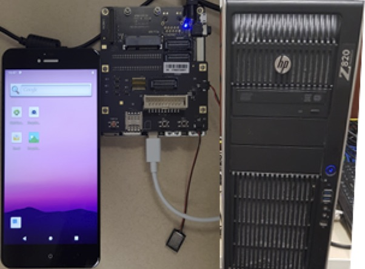

# Snapdragon (amundsen/mcmurdo)

## Description

The Qualcomm® Snapdragon™ 855 Mobile Hardware Development Kit (HDK) is a highly integrated and optimized Android development platform.

Accessing this system:

* Qualcomm board is connected to an HPZ820 workstation (McMurdo) or to an HP Z4 workstation (Clark) through USB
* Development Environment: Android SDK/NDK
* Login to mcmurdo or clark
  * $ ssh –Y mcmurdo
* Setup Android platform tools and development environment
  * $ source /home/nqx/setup_android.source
* Make sure you have a functioning environment 
  * adb kill-server
  * adb start-server
  * adb root (restart adbd as root)
  * adb devices (to make sure there is a snapdragon responding)
  * adb shell (to test connecting to the device)
* Run Hello-world on ARM cores
  * $ git clone [https://code.ornl.gov/nqx/helloworld-android](https://code.ornl.gov/nqx/helloworld-android)
  * $ make  compile  push  run
* Run OpenCL example on GPU
  * $ git clone [https://code.ornl.gov/nqx/opencl-img-processing](https://code.ornl.gov/nqx/opencl-img-processing)
  * Run Sobel edge detection
    * $ make  compile  push  run  fetch
  * Login to Qualcomm development board shell
    * $ adb shell
    * $ cd /data/local/tmp

## Other Details
The snapdragon SDK uses python 2.7; you may need to explicitly specify python2 in your environment.

## Access

Access will be granted per request (as this cannot be used as a shared resource).

## Useful Links

1. Android Studio: [https://developer.android.com/studio](https://developer.android.com/studio)
2. Qualcomm HDK: [https://developer.qualcomm.com/hardware/snapdragon-855-hdk](https://developer.qualcomm.com/hardware/snapdragon-855-hdk)
3. Qualcomm Neural Processor SDK: [https://developer.qualcomm.com/software/qualcomm-neural-processing-sdk](https://developer.qualcomm.com/software/qualcomm-neural-processing-sdk)

    [https://developer.qualcomm.com/docs/snpe/overview.htm](https://developer.qualcomm.com/docs/snpe/overview.htm)

## Images

