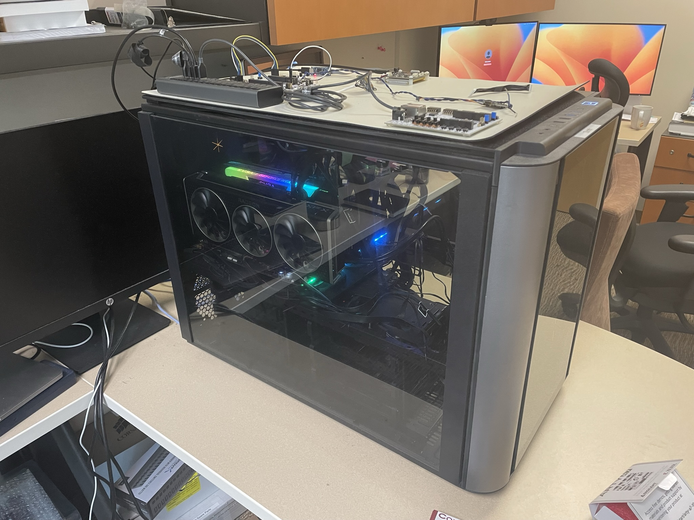
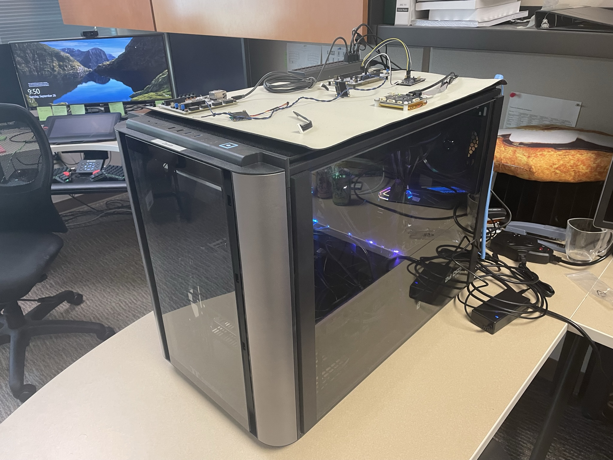
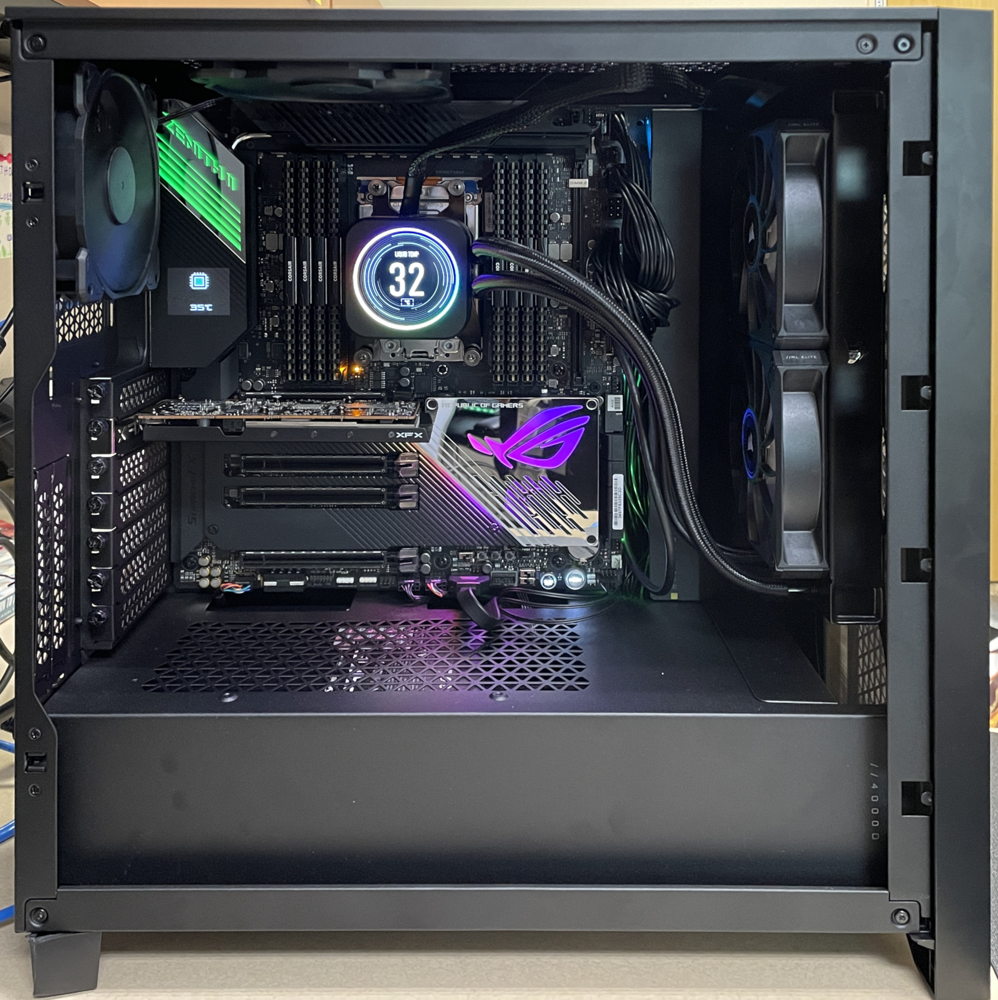

# zenith

## Zenith 1

Created using PC Part Picker. The build is available at [https://pcpartpicker.com/list/xPkRwc](https://pcpartpicker.com/list/xPkRwc).

[PCPartPicker Part List](https://pcpartpicker.com/list/xPkRwc)

| Type                                                                            | Item                                                                                                                                                                                                                             | Price             |
| ------------------------------------------------------------------------------- | -------------------------------------------------------------------------------------------------------------------------------------------------------------------------------------------------------------------------------- | ----------------- |
| **CPU**                                                                         | [AMD Threadripper 3970X 3.7 GHz 32-Core Processor](https://pcpartpicker.com/product/rkwkcf/amd-threadripper-3970x-37-ghz-32-core-processor-100-100000011wof)                                                                     | $2300.98 @ Amazon |
| **CPU Cooler**                                                                  | [Corsair iCUE H150i ELITE CAPELLIX 75 CFM Liquid CPU Cooler](<https://pcpartpicker.com/product/8jFKHx/corsair-icue-h150i-elite-capellix-75-cfm-liquid-cpu-cooler-cw-9060048-ww>)                                                   | -                 |
| **Motherboard**                                                                 | [Asus ROG ZENITH II EXTREME ALPHA EATX sTRX4 Motherboard](<https://pcpartpicker.com/product/zcyqqs/asus-rog-zenith-ii-extreme-alpha-eatx-strx4-motherboard-rog-zenith-ii-extreme-alpha>)                                           | $1988.99 @ Amazon |
| **Memory**                                                                      | [G.Skill Ripjaws V 128 GB (4 x 32 GB) DDR4-3600 CL18 Memory](https://pcpartpicker.com/product/KyZzK8/gskill-ripjaws-v-128-gb-4-x-32-gb-ddr4-3600-memory-f4-3600c18q-128gvk)                                                      | $249.99 @ Amazon  |
| **Storage**                                                                     | [Samsung 980 Pro 2 TB M.2-2280 PCIe 4.0 X4 NVME Solid State Drive](<https://pcpartpicker.com/product/f3cRsY/samsung-980-pro-2-tb-m2-2280-nvme-solid-state-drive-mz-v8p2t0bam>)                                                     | $125.65 @ Amazon  |
| **Video Card**                                                                  | [EVGA FTW3 ULTRA GAMING GeForce RTX 3090 24 GB Video Card](https://pcpartpicker.com/product/PG848d/evga-geforce-rtx-3090-24-gb-ftw3-ultra-gaming-video-card-24g-p5-3987-kr)                                                      | $1499.99 @ Amazon |
| **Video Card**                                                                  | [Gigabyte GAMING OC Radeon RX 6900 XT 16 GB Video Card](<https://pcpartpicker.com/product/YfvdnQ/gigabyte-radeon-rx-6900-xt-16-gb-gaming-oc-video-card-gv-r69xtgamingoc16gd>)                                                      | $1720.23 @ Amazon |
| **Case**                                                                        | [Thermaltake Core X9 ATX Desktop Case](https://pcpartpicker.com/product/V998TW/thermaltake-case-ca1d800f1wn00)                                                                                                                   | -                 |
| **Power Supply**                                                                | [EVGA SuperNOVA 1600 P2 1600 W 80+ Platinum Certified Fully Modular ATX Power Supply](https://pcpartpicker.com/product/LbtWGX/evga-supernova-1600-p2-1600-w-80-platinum-certified-fully-modular-atx-power-supply-220-p2-1600-x1) | $304.99 @ Newegg  |
| **Case Fan**                                                                    | [Noctua F12 PWM chromax.black.swap 54.97 CFM 120 mm Fan](<https://pcpartpicker.com/product/cFwqqs/noctua-nf-f12-pwm-chromaxblackswap-550-cfm-120mm-fan-nf-f12-pwm-chromaxblackswap>)                                               | $24.75 @ Amazon   |
| **Case Fan**                                                                    | [Noctua F12 PWM chromax.black.swap 54.97 CFM 120 mm Fan](https://pcpartpicker.com/product/cFwqqs/noctua-nf-f12-pwm-chromaxblackswap-550-cfm-120mm-fan-nf-f12-pwm-chromaxblackswap)                                               | $24.75 @ Amazon   |
| **Monitor**                                                                     | [HP X27q 27.0" 2560 x 1440 165 Hz Monitor](<https://pcpartpicker.com/product/cB3gXL/hp-x27q-270-2560x1440-165-hz-monitor-2v7u5aaabu>)                                                                                              | $289.00 @ Amazon  |
| _Prices include shipping, taxes, rebates, and discounts_                        |                                                                                                                                                                                                                                  |                   |
| **Total**                                                                       | **$8529.32**                                                                                                                                                                                                                     |                   |
| Generated by [PCPartPicker](https://pcpartpicker.com) 2023-09-26 09:48 EDT-0400 |                                                                                                                                                                                                                                  |                   |

### Access to the GPUs

To have access to the GPUs, request to be added to the `video` and `render` groups if you are not already in these groups.

### Images

## Zenith 2

Created using PC Part Picker. The build is available at <https://pcpartpicker.com/list/vjXBPF>.

[PCPartPicker Part List](https://pcpartpicker.com/list/vjXBPF)

| Type                                                                            | Item                                                                                                                                                                                                                                                | Price             |
| :------------------------------------------------------------------------------ | :-------------------------------------------------------------------------------------------------------------------------------------------------------------------------------------------------------------------------------------------------- | :---------------- |
| **CPU**                                                                         | [AMD Threadripper 3970X 3.7 GHz 32-Core Processor](https://pcpartpicker.com/product/rkwkcf/amd-threadripper-3970x-37-ghz-32-core-processor-100-100000011wof)                                                                                        | $1605.00 @ Amazon |
| **CPU Cooler**                                                                  | [Corsair iCUE H100i ELITE LCD 58.1 CFM Liquid CPU Cooler](<https://pcpartpicker.com/product/Lsstt6/corsair-icue-h100i-elite-lcd-581-cfm-liquid-cpu-cooler-cw-9060061-ww>)                                                                           | $250.00 @ Amazon  |
| **Motherboard**                                                                 | [Asus ROG ZENITH II EXTREME ALPHA EATX sTRX4 Motherboard](https://pcpartpicker.com/product/zcyqqs/asus-rog-zenith-ii-extreme-alpha-eatx-strx4-motherboard-rog-zenith-ii-extreme-alpha)                                                              | -                 |
| **Memory**                                                                      | [Corsair Vengeance LPX 256 GB (8 x 32 GB) DDR4-3200 CL16 Memory](https://pcpartpicker.com/product/ZZQfrH/corsair-vengeance-lpx-256-gb-8-x-32-gb-ddr4-3200-memory-cmk256gx4m8e3200c16)                                                               | $649.99 @ Amazon  |
| **Storage**                                                                     | [Samsung 980 Pro 2 TB M.2-2280 PCIe 4.0 X4 NVME Solid State Drive](<https://pcpartpicker.com/product/f3cRsY/samsung-980-pro-2-tb-m2-2280-nvme-solid-state-drive-mz-v8p2t0bam>)                                                                      | $169.99 @ B&H     |
| **Video Card**                                                                  | [XFX Speedster SWFT 105 Radeon RX 6400 4 GB Video Card](https://pcpartpicker.com/product/39ddnQ/xfx-radeon-rx-6400-4-gb-speedster-swft-105-video-card-rx-64xl4sfg2)                                                                                 | $159.99 @ Amazon  |
| **Case**                                                                        | [Corsair 4000D Airflow ATX Mid Tower Case](<https://pcpartpicker.com/product/bCYQzy/corsair-4000d-airflow-atx-mid-tower-case-cc-9011200-ww>)                                                                                                        | $89.99 @ Amazon   |
| **Power Supply**                                                                | [SeaSonic PRIME PX-1600 ATX 3.0 1600 W 80+ Platinum Certified Fully Modular ATX Power Supply](https://pcpartpicker.com/product/jWrqqs/seasonic-prime-px-1600-atx-30-1600-w-80-platinum-certified-fully-modular-atx-power-supply-atx3-prime-px-1600) | $456.21 @ Amazon  |
| **Case Fan**                                                                    | [Noctua A14 PWM chromax.black.swap 82.52 CFM 140 mm Fan](<https://pcpartpicker.com/product/sWM323/noctua-nf-a14-pwm-chromaxblackswap-825-cfm-140mm-fan-nf-a14-pwm-chromaxblackswap>)                                                                | $26.95 @ Amazon   |
| **Case Fan**                                                                    | [Noctua A14 PWM chromax.black.swap 82.52 CFM 140 mm Fan](https://pcpartpicker.com/product/sWM323/noctua-nf-a14-pwm-chromaxblackswap-825-cfm-140mm-fan-nf-a14-pwm-chromaxblackswap)                                                                  | $26.95 @ Amazon   |
| **Case Fan**                                                                    | [Noctua A12x15 PWM chromax.black.swap 55.44 CFM 120 mm Fan](<https://pcpartpicker.com/product/FM3mP6/noctua-nf-a12x15-pwm-chromaxblackswap-5544-cfm-120-mm-fan-nf-a12x15-pwm-chromaxblackswap>)                                                     | $26.95 @ Amazon   |
| _Prices include shipping, taxes, rebates, and discounts_                        |                                                                                                                                                                                                                                                     |                   |
| **Total**                                                                       | **$3462.02**                                                                                                                                                                                                                                        |                   |
| Generated by [PCPartPicker](https://pcpartpicker.com) 2024-06-27 12:09 EDT-0400 |                                                                                                                                                                                                                                                     |                   |

### Images

## Arty A7

- [Arty A7 - Start](https://digilent.com/reference/programmable-logic/arty-a7/start)
- [Arty A7 Reference Manual](https://digilent.com/reference/programmable-logic/arty-a7/reference-manual)

To get started, first install the [digilent board files](https://digilent.com/reference/programmable-logic/guides/installing-vivado-and-vitis#install_digilent_s_board_files). I recommend using the git approach. Once setup you can load the Vitis module and start developing with Vivado. See [Setting up the Vitis FPGA Development Environment](../quick-start-guides/vitis.md#setting-up-the-vitis-environment). To reserve the hardware use Slurm like normal, See [fish helper, slurm launch functions](../quick-start-guides/vitis.md#using-vitis-with-the-fish-shell-recommended-approach).