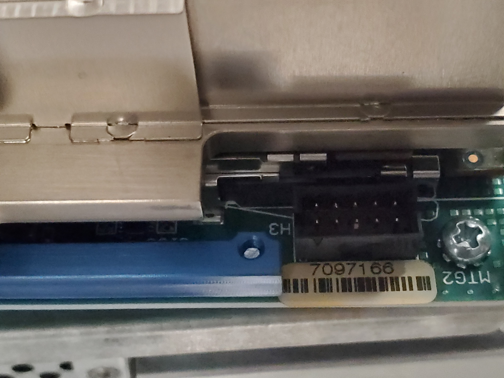
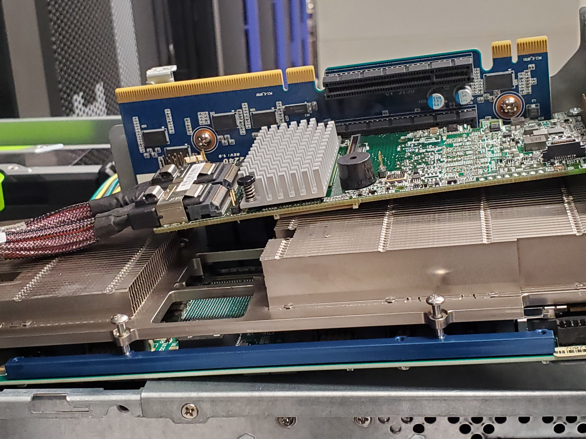

# oswald03

## Description

This system is a generic development server purchased with the intent of housing various development boards as needed.

The system is

* Penguin Computing Relion 2903GT
* Gigabyte motherboard MD90-FS0-ZB
* 256 GB memory
* Intel\(R\) Xeon\(R\) CPU E5-2683 v4 @ 2.10GHz  2x16 cores no hyperthreading
* Centos

## Access

There is not currently special access permissions. System is available to ExCL users. This may change as needed.

## Images

 

## Contact

Please send assistance requests to excl-help@ornl.gov.

